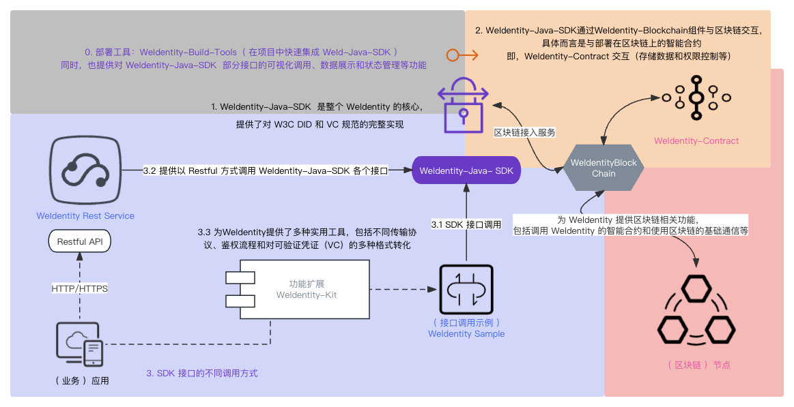

// 鹏  WeIdentity 自定义任务 40

**教程 之 WeIdentity 入门：学习图谱和体验流程

— 附件1：搭建 WeIdentity 所需的 “ 单链 2 机构 2 群组 2 节点 ”

— 附件2：使用 WeIdentity 部署工具：weid-build-tools，完成部署（ 可视化 ）

— 附件3：WeIdentity Restful API - postman


# WeIdentity 入门：学习图谱和流程体验

基于区块链技术的分布式数字身份，是一种自我主权、可验证的新型数字身份。W3C 为这种数字身份定义了：

​          ① **分布式数字身份标识符** Decentralized Identifiers（ Ξ [DIDs](https://w3c.github.io/did-core/) ）：Core architecture, data model, and representations

​                    ⇓                      ±            ② **可验证数字凭证 VC 规范**：Ξ [Verifiable Credentials Data Model v2.0](https://w3c.github.io/vc-data-model/)

​      Ξ △ [WeIdentity 规范](https://weidentity.readthedocs.io/zh_CN/latest/docs/weidentity-spec.html) 提供了对 W3C DIDs 和 VC 规范的完整实现，并提供了丰富的周边支撑工具和服务




## WeIdentity 的部署和使用：使用依赖区块链  /  ~~不依赖区块链的方式~~


**（一）准备工作**

- **操作系统**：CentOS（ 7.2.* 64位 ）或 Ubuntu（ 16.04 64 位 ），以 CentOS 为例
- **JDK**：要求 Oracle JDK 1.8+，如果在使用 WeIdentity 过程中，发现 JDK 版本导致的任何问题，推荐使用：

​       jdk8u141、jdk8u212、jdk8u231；JDK 与 WeID 直接的兼容性，可参考：Ξ [兼容性文档](https://weidentity.readthedocs.io/zh_CN/latest/docs/weid-compatibility-test.html)

```
$ java -version

java version "1.8.0_231"
Java(TM) SE Runtime Environment (build 1.8.0_231-b11)
Java HotSpot(TM) 64-Bit Server VM (build 25.231-b11, mixed mode)
```

- **搭建 FISCO-BCOS 区块链环境：**

​       以 ⭐️ WeIdentity 所需要的 “ **<u>单链 2 机构 2 群组 2 节点（ 见，附件1 ）</u>** ” 为例

​                                                                            ±        ⭐️ Ξ [**搭建 WeBase 管理平台：Docker 一键部署**](https://webasedoc.readthedocs.io/zh_CN/latest/docs/WeBASE-Install/docker_install.html)

- **网络连通**：检查部署 WeIdentity JAVA SDK 的服务器，是否能 telnet 通 FISCO BCOS 节点的 channel 端口

  

------


**（二）使用 WeIdentity 部署工具：**⭐️ **weid-build-tools**（ **<u>可视化方式（ 见，附件2 ）</u>）  / ** Ξ [其他功能](https://weidentity.readthedocs.io/zh_CN/latest/docs/weidentity-quick-tools-web.html) ），**完成部署**

​                                                                   **⇓ ** **部署  ① 智能合约（ Ξ [设计与实现](https://weidentity.readthedocs.io/zh_CN/latest/docs/weidentity-contract-design.html) ）** ⇑                ↔     ~~也可以使用：Ξ [命令行方式](https://weidentity.readthedocs.io/zh_CN/latest/docs/deploy-via-commandline.html)~~

​                                                     **② WeIdentity-Java-SDK** **（** **Ξ [接口文档](https://weidentity.readthedocs.io/projects/javasdk/zh_CN/latest/) ）** 


​                   ↗ （ **方式一**：通过 ~~**JAVA** API 方式调用 SDK~~ ）                 ↖    另，Ξ ~~[WeIdentity JAVA SDK 便捷使用工具](https://weidentity.readthedocs.io/zh_CN/latest/docs/weidentity-quick-tools.html)~~

​    运行 Ξ [Sample](https://weidentity.readthedocs.io/zh_CN/latest/docs/weidentity-sample.html) or Ξ [Kit](https://weidentity.readthedocs.io/zh_CN/latest/docs/weidentity-kit.html)，体验接口（ 示例 ）      ↗

​    Ξ  [~~在自己的 Java Service 中集成 WeIdentity-Java-SDK~~](https://weidentity.readthedocs.io/zh_CN/latest/docs/sdk-integration.html)                 **⇓⇓**


​                    **方式二**：如果使用的是其他语言（ ~ ），而 **非 Java**，可以使用 ⭐️ **WeIdentity ③ RestService**（ Ξ [文档](https://weidentity.readthedocs.io/zh_CN/latest/docs/weidentity-rest.html)  |  [GitHub 仓库](https://github.com/WeBankBlockchain/WeIdentity-Rest-Service) ）

​                                                                           —  即：WeIdentity Restful HTTP Service，提供了简化的 WeIdentity 集成方式与访问能力

​                                                                                                                     「 Ξ [部署](https://weidentity.readthedocs.io/zh_CN/latest/docs/weidentity-rest-deploy.html) 」使用者仅需将 RestService 部署到一台 JAVA 的机器上

「 **使用**：Ξ [API 接口](https://weidentity.readthedocs.io/zh_CN/latest/docs/weidentity-rest-api.html)（ Postman，见附件3 ） ⇓⇓⇓   ⭐️ ④ ~ 中间层 」就可以使用各类 HTTP/HTTPS 协议访问 WeIdentity 的功能了 ...


## 应用：基于 WeIdentity ~ 中间层 的 ⭐️ XXX（ 略 ）

（ 略 ）