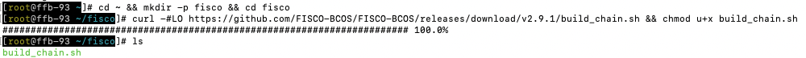
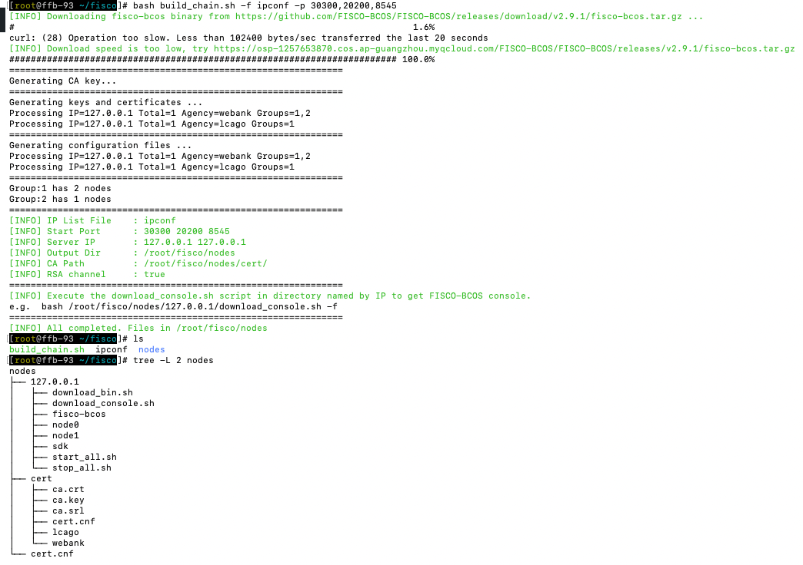
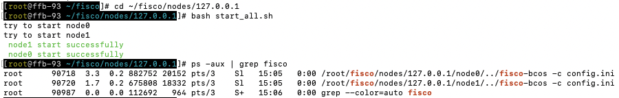
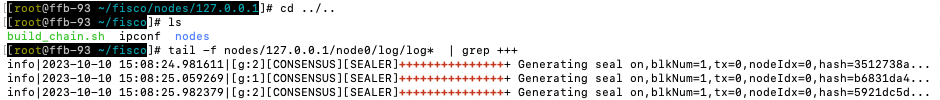

## 搭建 WeIdentity 所需的 “ 单链 2 机构 2 群组 2 节点 ”


```
// 开发部署工具 build——chain.sh 脚本，依赖于 openssl、curl，请根据所在操作系统，安装依赖
 
sudo yum install -y openssl openssl-devel  // 以 centos 为例
```


#### 1. 创建操作目录，下载开发部署工具 build_chain.sh 脚本

```
# 创建操作目录
cd ~ && mkdir -p fisco && cd fisco

# 下载脚本
curl -#LO https://github.com/FISCO-BCOS/FISCO-BCOS/releases/download/v2.9.1/build_chain.sh && chmod u+x build_chain.sh

如果因为网络问题导致长时间无法下载build_chain.sh脚本，请尝试：
curl -#LO https://osp-1257653870.cos.ap-guangzhou.myqcloud.com/FISCO-BCOS/FISCO-BCOS/releases/v2.9.1/build_chain.sh && chmod u+x build_chain.sh
```




#### 2. 在 build_chain.sh 同一目录下，创建 ipconf 文件

```
$ vim ipconf

# 空格分隔的参数分别表示如下含义：
# ip:num: 物理机IP以及物理机上的节点数目
# agency_name: 机构名称
# group_list: 节点所属的群组列表，不同群组以逗号分隔
127.0.0.1 webank 1,2
127.0.0.1 lcago 1
```


#### 3. 一键建链

```
# 根据配置生成区块链，需要保证机器的30300~30301，20200~20201，8545~8546端口没有被占用

$ bash build_chain.sh -f ipconf -p 30300,20200,8545
```




#### 4. 启动节点：节点提供 start_all.sh 和 stop_all.sh 脚本，启动和停止节点

```
# 进入节点目录
$ cd ~/fisco/nodes/127.0.0.1

# 启动节点
$ bash start_all.sh

# 停止节点
$ bash stop_all.sh
```




#### 5. 查看共识是否成功

```
// 主要通过日志中的 +++ 来看是否成功，只有共识成功了，才能算区块链网络搭建好了

tail -f nodes/127.0.0.1/node0/log/log*  | grep +++
```

