## 使用 WeIdentity 部署工具：weid-build-tools，完成部署（ 可视化 ）


#### 1. 安装 WeIdentity 部署工具：weid-build-tools


**「 Ξ [安装 weid-build-tools](https://weidentity.readthedocs.io/zh_CN/latest/docs/weidentity-installation-by-web.html) 」**一个网页工具，可以用来完成 WeIdentity 的部署，同时，也提供了一些其他功能

```
// 这里主要是针对依赖区块链的部署方式
// 不依赖区块链的 WeIdentity 版本（ 3.1.0-rc及以上 ），无需经过可视化部署

// 建议在内网环境搭建安装部署

// 启动的可视化安装工具，默认会监听 6021 端口，不能对外网开发访问

# 下载安装脚本
wget -c https://gitee.com/WeBank/WeIdentity-Build-Tools/raw/master/common/script/install/weid_install.sh

# 执行安装脚本：默认使用最新版本的可视化部署工具，如果想安装指定版本，可以使用 -v，如：./weid_install.sh -v 1.0.12
chmod u+x weid_install.sh
./weid_install.sh
cd weid-build-tools && mkdir -p resources/conf/amop && cp common/script/consumer_p* resources/conf/amop/

# 启动 Web 服务，成功后，可以通过 http://IP:6021 访问可视化部署工具的 Web 页面
./start.sh

# Then，可以进行 WeIdentity 的部署和其他配置了 ...（ 如下所示： ）
```

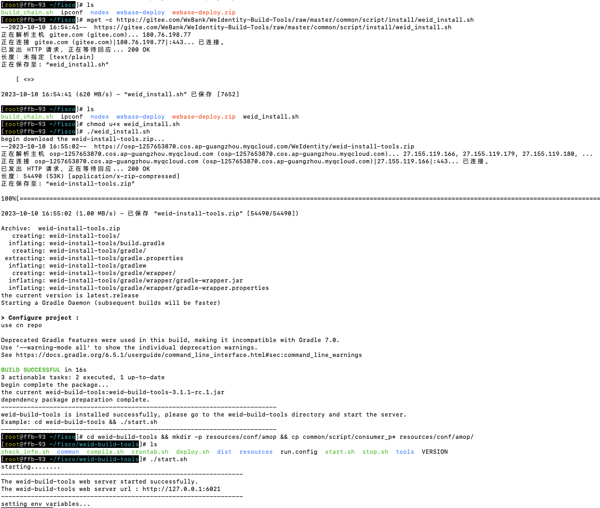


#### 2. 可视化部署

​                                                                                                                    「 Ξ [**使用可视化部署方式，进行部署**](https://weidentity.readthedocs.io/zh_CN/latest/docs/deploy-via-web.html) 」

**[1] WeBase 管理平台**

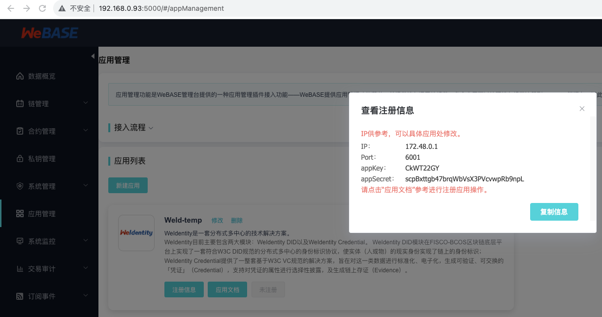


**[2] WeIdentity（ 可视化 ）部署工具**


使用 “ WeIdentity（ 可视化 ）部署工具 ” 的服务器的 IP，访问 Web 页面：http://IP:6021

```
// 因为 “ WeIdentity 可视化部署工具 ” 没有账号登录机制，所以，必须确保整个环境只在内网可以访问
// 也就是说，公网的其他用户，不能访问
```


**（1）选择集成方式**

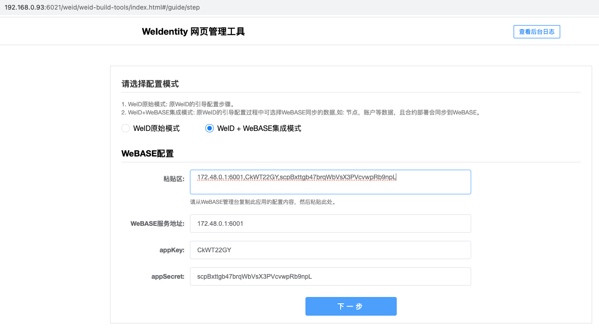


**（2）选择角色**

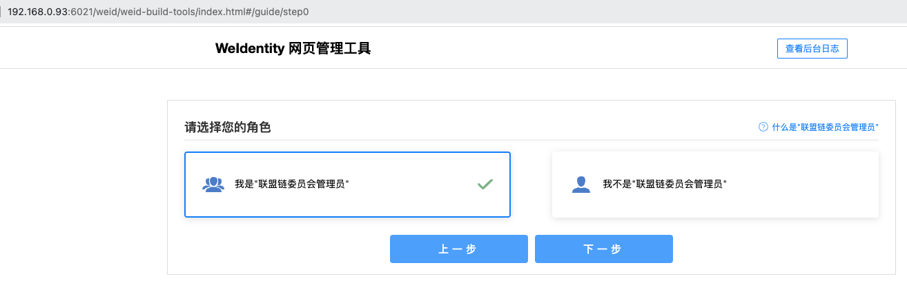


**（3）配置区块链节点**

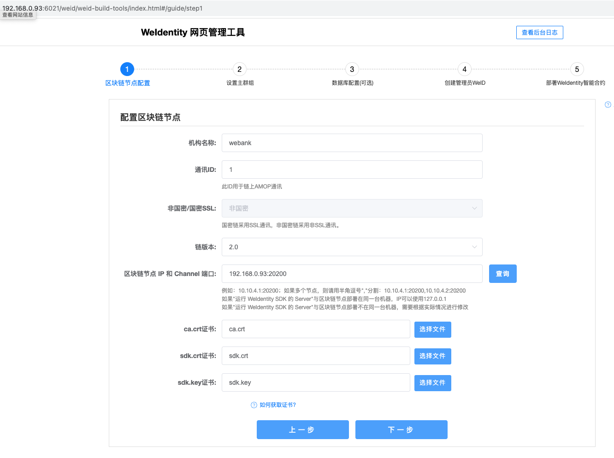

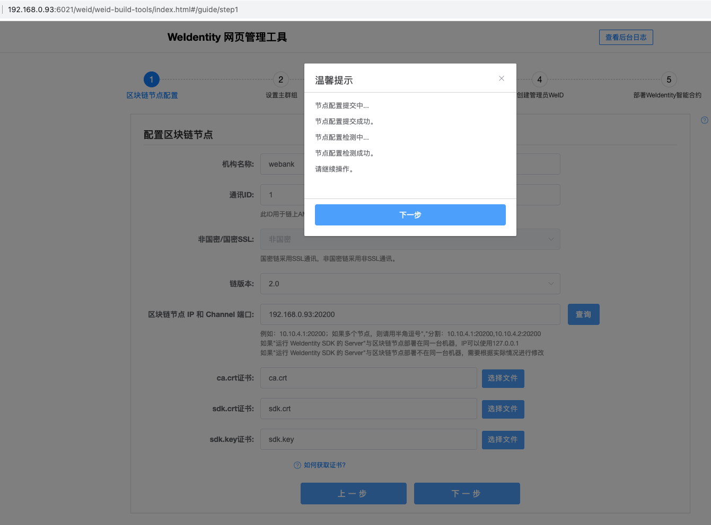


**（4）设置主群组**

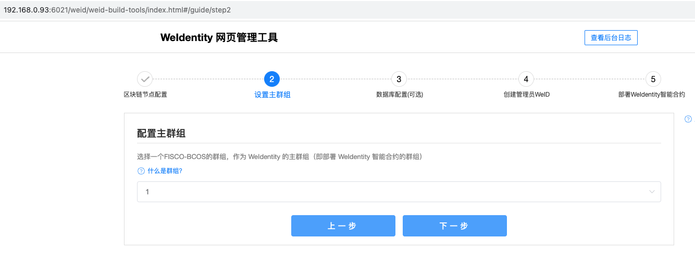

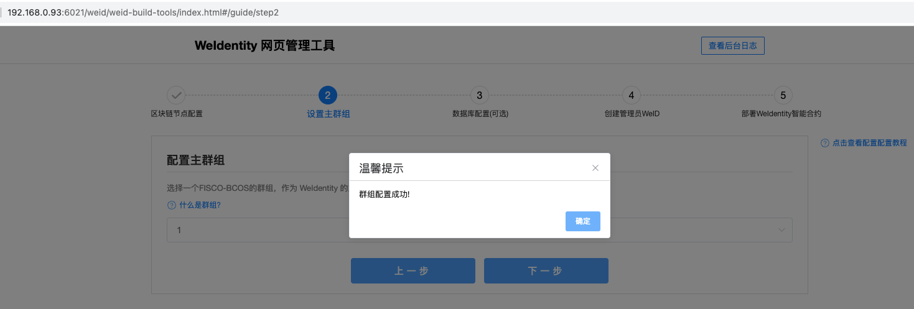


**（5）配置数据库（ 可选 ）**

// 准备好数据库

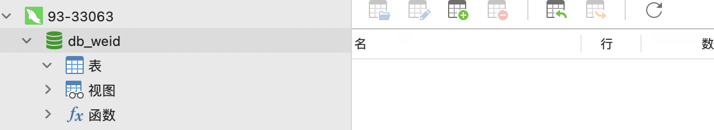

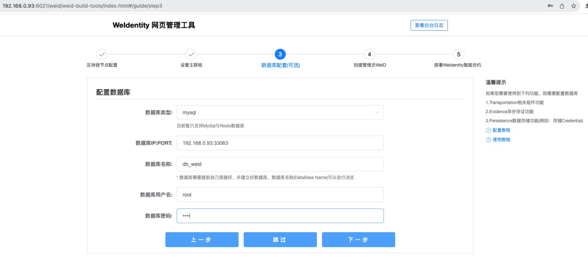

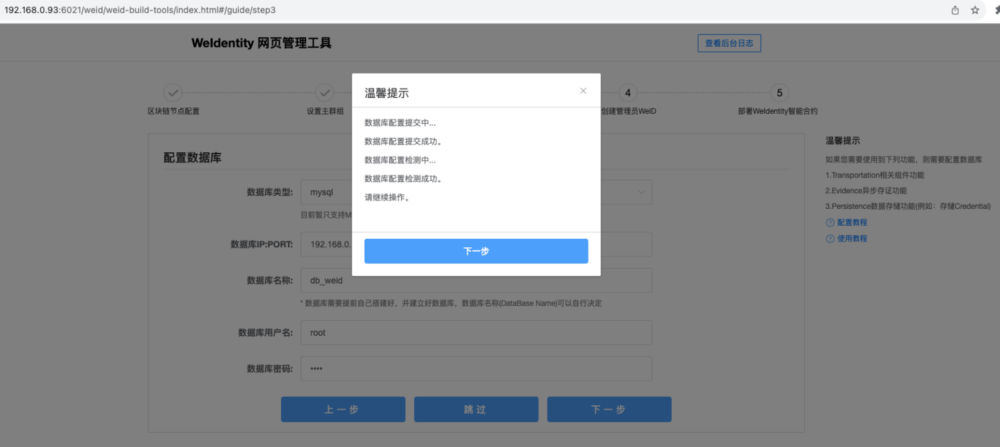


**（6）创建管理员的 WeID**

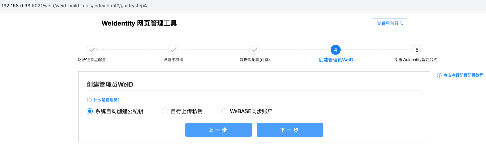

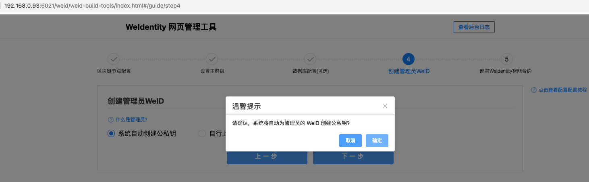

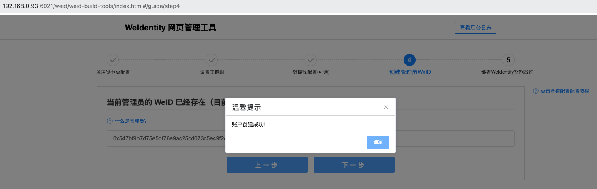

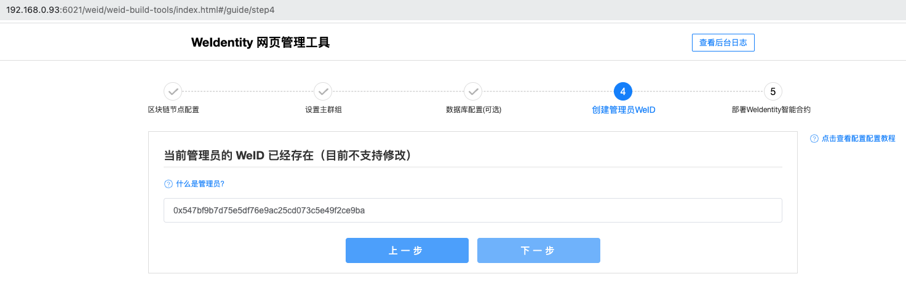


**（7）部署 WeIdentity 智能合约**


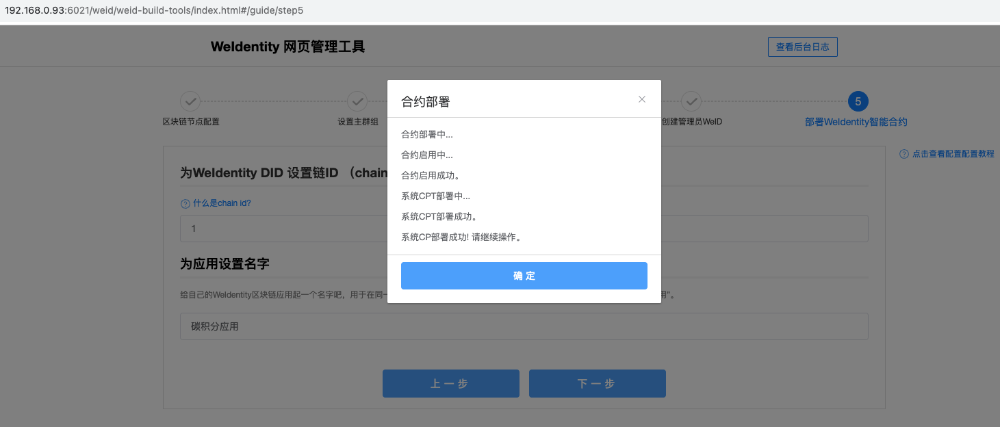

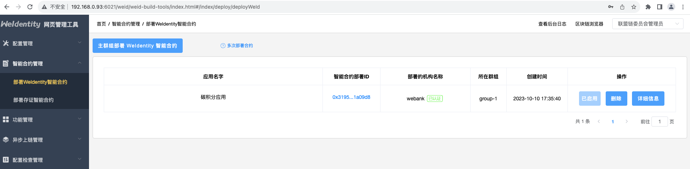