# WeIdentity DID 接口时序

## WeIdentity DID时序
### 创建WeIdentity DID及公私钥对

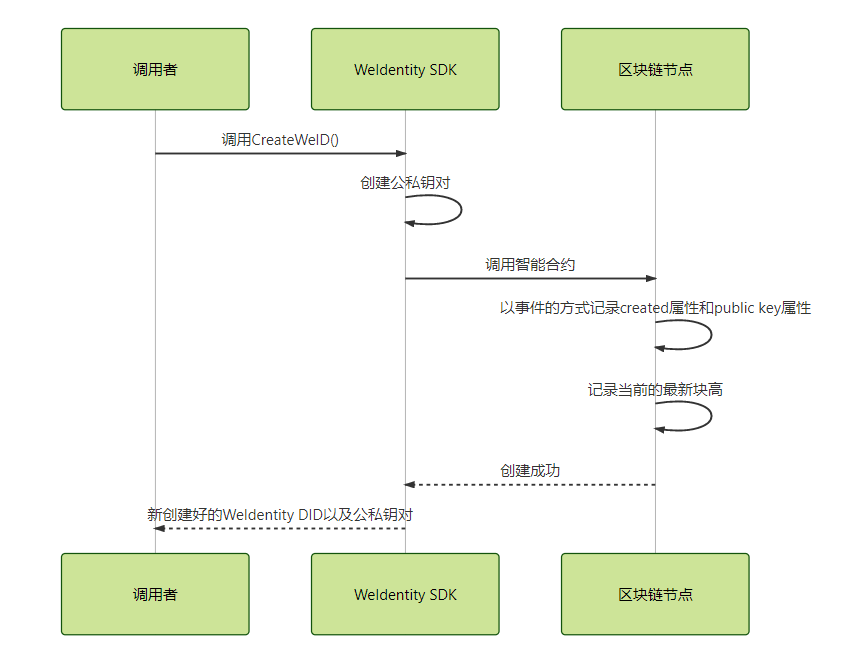

### 根据公钥创建WeIdentity DID
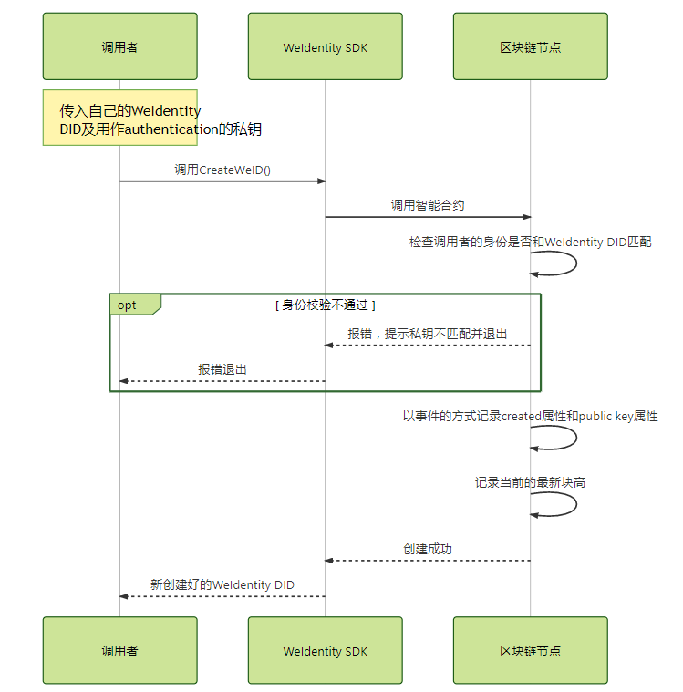

### 添加公钥

### 添加authentication
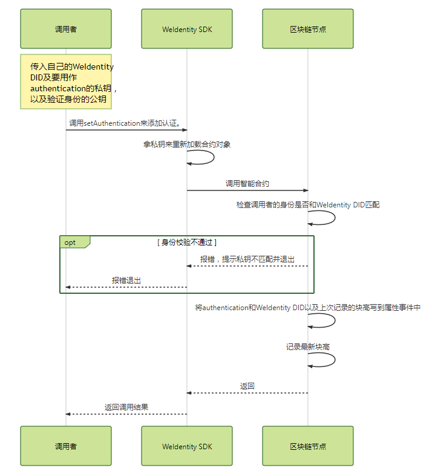

### 添加service endpoint
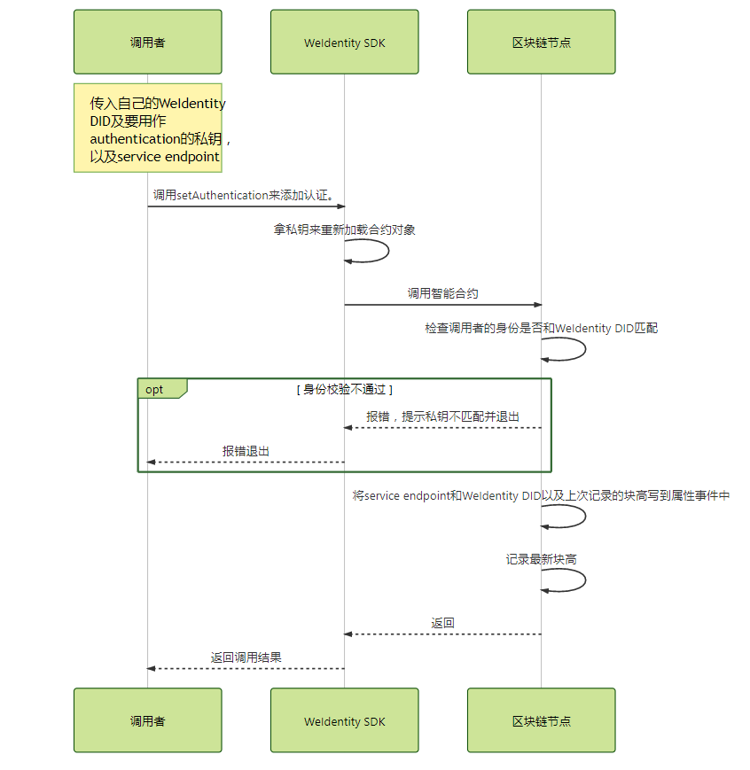

### 获取WeIdentity docment
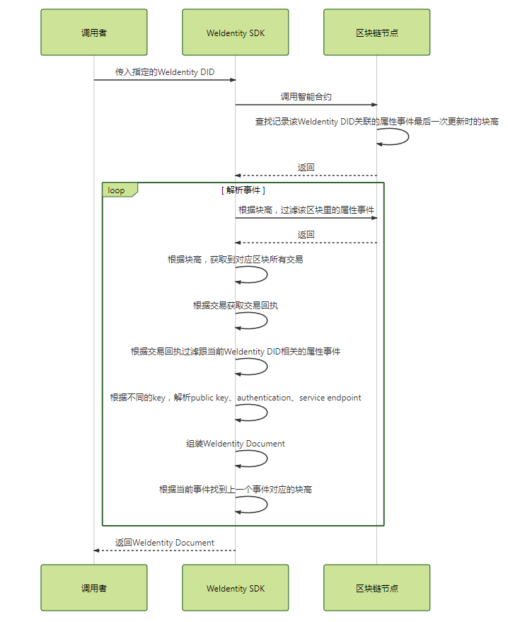

## AuthorityIssuer 时序
### 创建AuthorityIssuer
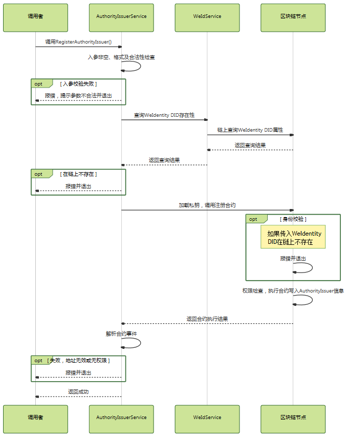

### 删除AuthorityIssuer
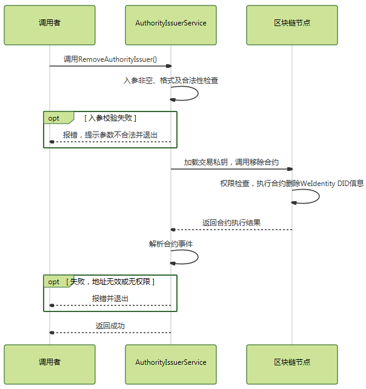

### 判断是否是AuthorityIssuer
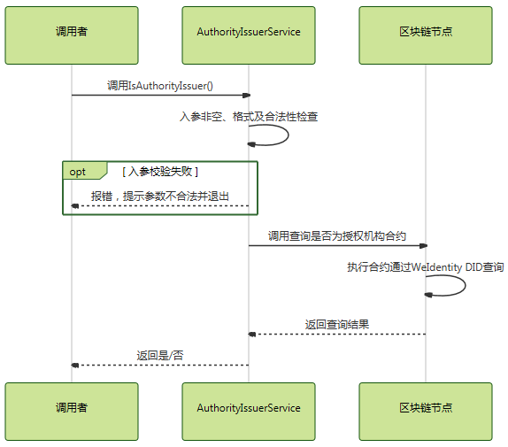

### 查询AuthorityIssuer信息
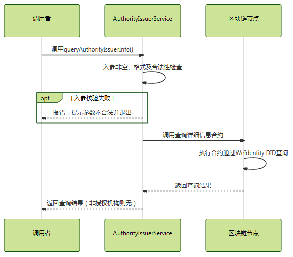

## CPT时序
### 创建CPT
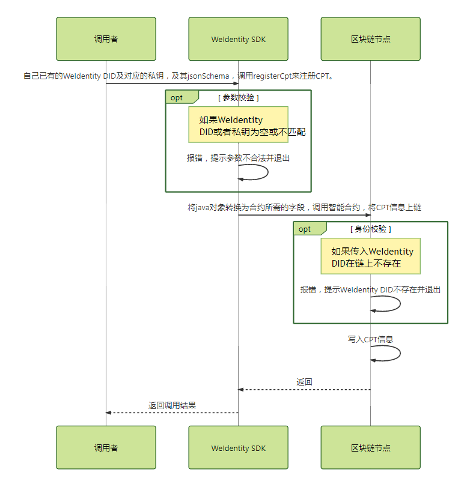

### 查询CPT
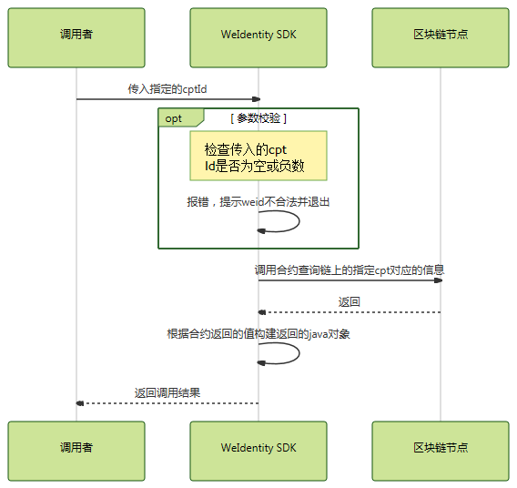

### 更新CPT
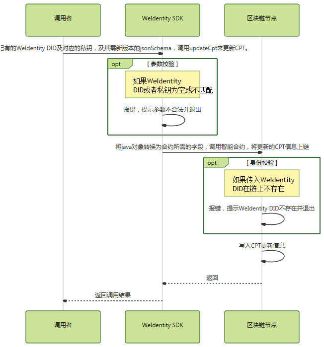

## Credential时序
### 创建Credential
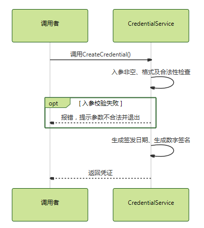

### 验证Credential
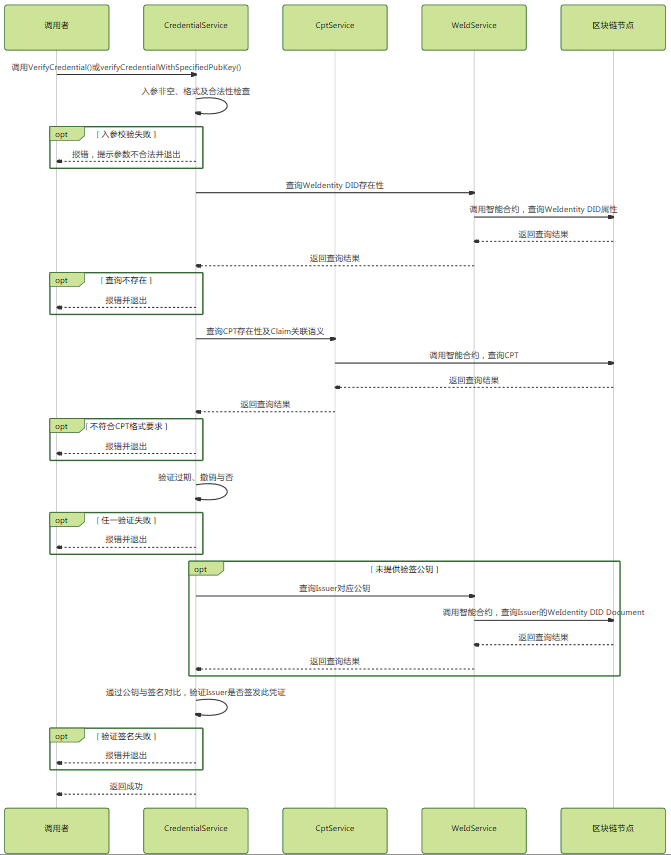
