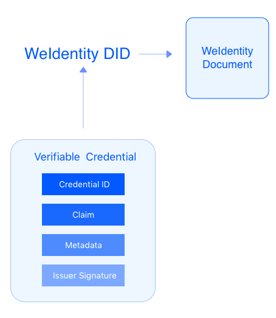
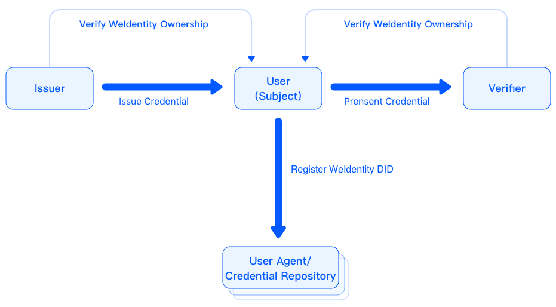
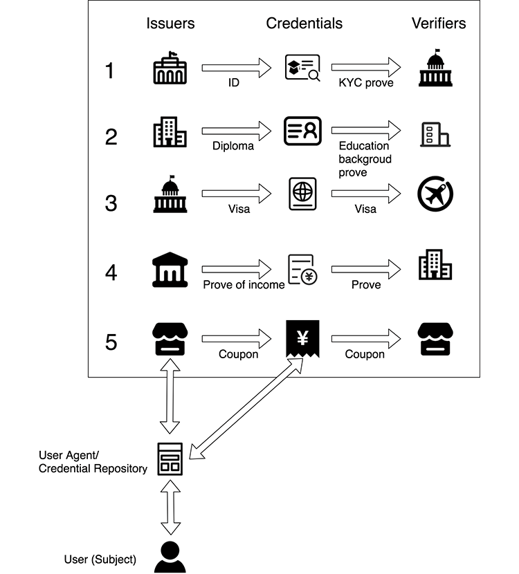
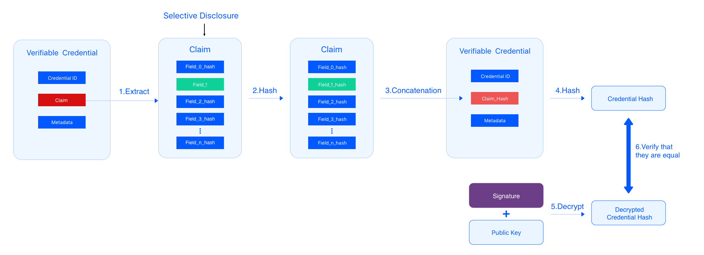
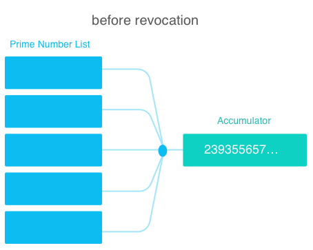
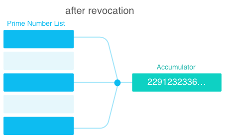

# WeIdentity 规范文档

| 版本 | 说明              | 作者 |
| :------ | :----------------------- | ------ |
| V0.1.0    | 完成整体协议框架                | 张俊麒    |
| V0.2.0    | 完善流程,ER等                | 张俊麒    |
| V0.3.0    | 添加选择性披露，Notification机制  | 张俊麒    |
| V0.3.1    | 补充WeIdentity Docment，增加CPT字段定义 | 陈浩     |
| V0.3.2    | 描述修改 | 张俊麒     |

## 1.设计目标

<table style="width:100%">
  <tr>
    <th width="100">目标</th>
    <th>说明</th>
  </tr>
  <tr>
    <td>多中心</td>
    <td>分布式多中心的ID注册机制，摆脱对传统模式下单一中心ID注册的依赖</td>
  </tr>
  <tr>
    <td>开源开放</td>
    <td>技术方案完全开源，面向政府、企业、开发者服务</td>
  </tr>
  <tr>
    <td>隐私保护</td>
    <td>实体的现实身份和可验证数字凭证的内容进行链下存储。支持实体将信息最小化或者选择性披露给其他机构，同时防止任何第三方反向推测出实体在现实世界或其他场景语义中的身份</td>
  </tr>
  <tr>
    <td>可移植性</td>
    <td>基于WeIdentity规范，数据可移植至遵循同样规范的其他平台，兼容业务主流区块链底层平台</td>
  </tr>
  <tr>
    <td>互操作性</td>
    <td>提供标准化接口，支持跨链、跨平台互操作</td>
  </tr>
  <tr>
    <td>可扩展性</td>
    <td>保证操作性，可移植性或简单性的情况下，数据模型可以通过多种不同方式进行扩展</td>
  </tr>
</table>

### 相关术语

详见：[术语表](./terminologies.md)	   

## 2.WeIdentity DID

### WeIdentity DID与WeIdentity Credential的关系



### 总体流程


### 如何生成WeIdentity DID

WeIdentity DID = did:weid:1::net-id:bs-specific-string


| 字段       | 说明                                |
| :------- | :-------------------------------- |
| did     | 遵循DID规范，固定前缀did              |
| weid | WeIdentity DID规范的method name字段，固定为weid |
| net-id | 网络id，用于路由到不同的网络 |
| bs-specific-string | 基于底层区块链平台生成，代表Subject在链上的地址，保证全网唯一 |

备注：bsSpecificString根据区块链底层平台和业务具体情况来确定生成规则，例如可以是随机字符串，或者区块链上的地址。

示例: ```"did:weid:1:0x0086eb1f712ebc6f1c276e12ec21"```

### WeIdentity Document格式

| 字段  | 说明    |
| :--------- | :--------- |
| @context   | 用于描述WeIdentity Document结构等信息 |
| id | WeIdentity DID，表示当前Document描述的subject，用于自描述 |
| created | Document的创建时间 |
| updated | Document的更新时间
| publicKey | 公钥数组列表，格式如下 |
| publicKey.id | 公钥的ID |
| publicKey.type           | 用于指定signature suite                      |
| publicKey.owner          | 指定控制对应私钥的Subject，遵从WeIdentity规范，如果为空，则表明owner是Document的id字段，如果是Credential类Subject，则owner一般是某用户 |
| publicKey                |                                          |
| authentication           | 用于Subject证明其与当前Document的关联性               |
| authentication.type      | 用于指定signature suite                      |
| authentication.publicKey | 用来验证签名的公钥，引用publicKey数组里定义的公钥            |
| service                  | service描述数组，用于描述跟当前DID相关的服务，格式如下         |
| service.id               | service endpoint的ID                      |
| service.type             | service endpoint的协议                      |
| service.serviceEndpoint  | serviceEndpoint列表，可以是URI或者一个JSON-LD对象    |
| service.其他               | 待定                                       |
| recovery                 | WeIdentity DID私钥丢失后，可由本字段指定的WeIdentity进行公私钥重置。是否需要抽象一层合约层来实现待定 |

* WeIdentity DID的Authorization机制由补充规范实现。

示例：

```
{
  "@context": "https://weidentity.webank.com/did/v1",
  "id": "did:weid:1:123456789abcdefghi",
  "created": "2017-09-24T17:00:00Z",
  "updated": "2018-09-24T02:41:00Z",
  "publicKey": [{
    "id": "did:example:123456789abcdefghi#keys-1",
    "type": "RsaVerificationKey2018",
    "owner": "did:example:123456789abcdefghi",
    "publicKeyPem": "-----BEGIN PUBLIC KEY...END PUBLIC KEY-----\r\n"
  }, {
    "id": "did:example:123456789abcdefghi#keys-2",
    "type": "Secp256k1VerificationKey2018",
    "owner": "did:example:123456789abcdefghi",
    "publicKeyHex": "02b97c30de767f084ce3080168ee293053ba33b235d7116a3263d29f1450936b71"
  }],
  "authentication": [{
    // this key can be used to authenticate as DID ...9938
    "type": "RsaSignatureAuthentication2018",
    "publicKey": "did:weid:1:123456789abcdefghi#keys-1"
    }
  ],
  "service": [{
    "type": "drivingCardService",
    "serviceEndpoint": "https://weidentity.webank.com/endpoint/8377464"
    }, {
    "type": "padiCertificateService",
    "serviceEndpoint": "https://weidentity.webank.com/endpoint/8377465"
  }],
  "recovery": ["did:weid:1:2323e3e3dweweewew2","did:weid:1:2323e3e3dweweewew3"],
}
```

### WeIdentity DID支持操作

#### 创建
创建一个WeIdentity DID（以及对应的WeIdentity Document）

#### 读取/验证
通过WeIdentity DID读取到WeIdentity Document，并验证

#### 更新
更新WeIdentity Document的相关属性

## 3.WeIdentity Credentials

### 角色和关系



### 场景



### Credential结构

| 属性 | 说明 |
| :-------- | :------------ |
| @context | 用于描述Credential的字段信息等 |
| id | 本Credential的ID，按UUID生成 |
| issuer  | Issuer的DID，遵从WeIdentity规范 |
| issued | issue日期 |
| claim | Claim的具体细节，数据结构由CPT定义，详见CPT介绍 |
| claim.primeNumberIdx | 素数在素数表中的index |
| claim.type | Claim Protocol Type的ID，申请按序递增，例如中国内地驾照设置为CPT100 |
| revocation               | 撤销相关实现，待补充                               |
| signature                | Issuer的签名列表，是一个数组，可由holder和issuer分别打上签名  |
| signature.type           | 签名类型  |
| signature.created        | 签名的创建时间                                  |
| signature.creator        | 签名机构的WeIdentity DID                               |
| signature.domain | domain   |
| signature.nonce          | 随机数                                      |
| signature.signatureValue | 签名的具体value，对整个Credential结构中除去signature字段的其他字段做签名 |

### 区块链上的Credential结构

| 属性 | 说明    |
| :--------- | :------------- |
| id         | 同上             |
| type       | 同上             |
| issued     | 同上 |
| claimHash  | Claim结构内容的hash |
| revocation | 同上 |
| signature  | 同上 |

```
{
  "@context": "https://weidentity.webank.com/vc/v1",
  "id": "dsfewr23sdcsdfeqeddadfd",
  "type": ["Credential", "cpt100"],
  "issuer": "did:weid:1:2323e3e3dweweewew2",
  "issued": "2010-01-01T21:19:10Z",
  "claim": {
    "primeNumberIdx":"1234"
    //the other properties in this structure varied according to different CPT
  },
  "revocation": {
    "id": "did:weid:1:2323e3e3dweweewew2",
    "type": "SimpleRevocationList2017"
  },
  "signature": [{
    "type": "LinkedDataSignature2015",
    "created": "2016-06-18T21:19:10Z",
    "creator": "did:weid:1:2323e3e3dweweewew2",
    "domain": "www.diriving_card.com",
    "nonce": "598c63d6",
    "signatureValue": "BavEll0/I1zpYw8XNi1bgVg/sCneO4Jugez8RwDg/+MCRVpjOboDoe4SxxKjkC
  OvKiCHGDvc4krqi6Z1n0UfqzxGfmatCuFibcC1wpsPRdW+gGsutPTLzvueMWmFhwYmfIFpbBu95t501+r
    SLHIEuujM/+PXr9Cky6Ed+W3JT24="
  }]
}
```

### Claim Protocol Type(CPT)注册机制

不同的Issuer按业务场景需要，各自定义不同类型数据结构的Claim，所有的Claim结构都需要到CPT合约注册，以保证全网唯一。所有的CPT定义文件（JSON-LD格式）可以从CPT合约下载。

* CPT格式

| 属性  | 说明            |
| :---------- | :------------ |
| @context    | 用于描述CPT等信息    |
| id          | CPT的编号，要保证唯一 |
| version     | CPT的版本号     |
| publisher   | CPT的发布者的WeIdentity DID |
| signature   | CPT的发布者的签名   |
| claim       | Claim的格式定义  |
| created     | 创建时间       |
| updated     | 更新时间         |
| description | CPT的描述信息     |

* CPT例子

```
"CPT": {
  "@context" : "https://weidentity.webank.com/cpt100/v1",
  "version" : "v1",
  "id" : "CPT100",
  "publisher" : "did:weid:1:2323e3e3dweweewew2",
  "signature" : "BavEll0/I1zpYw8XNi1bgVg/sCneO4Jugez8RwDg/+MCRVpjOboDoe4SxxKjkC
  OvKiCHGDvc4krqi6Z1n0UfqzxGfmatCuFibcC1wpsPRdW+gGsutPTLzvueMWmFhwYmfIFpbBu95t501+r
    SLHIEuujM/+PXr9Cky6Ed+W3JT24=",
  "claim" : "",
  "address" : "重庆",
  "class" : "C1",
  "created" : "2010-06-20T21:19:10Z",
  "updated" : "2016-06-20T21:19:10Z",
  "description" : "中国内地驾照"
}
```


### Claim示例参考：

[Claim模板](cpt-templates.md)

### Credential操作

#### 创建Credential

任何实体都可以issue一个Credential。

#### 验证Credential

通过这个接口，一个Subject可以对一个Credential进行验证。

#### 存储/提取Credential

Credential的holder可以转移这个Credential，或者提取完整的Credential私下存储。

#### 撤销 Credential

Credential的Issuer可以撤销这个Credential。

### 选择性披露

#### 如何为Credential生成签名

Issuer生成Credential签名的过程：

1. Claim中的每个字段计算生成一个对应的hash值。
2. 将Claim中的每个字段的hash值以某种形式拼接起来形成一个字符串Claim_Hash，然后跟Credential原有的其他字段组成一个新的用于计算hash的Credential结构。
3. 对这个包含Claim_Hash的Credential结构计算hash，得到Credential Hash。
4. 使用Private Key对这个Credential Hash进行签名，得到签名的值Signature。


#### 如何验证选择性披露的Credential

用户选择需要披露的字段集合（可以是一个或者几个字段，这个例子中是Field_1），需要披露的字段提供原文，其他字段提供hash值。将包含这个Claim结构的Credential披露给Verifier。下面是Verifier验证的过程：

1. Verifier从Credential提取用户披露的Claim字段。
2. Verifier对用户披露的字段分别计算hash（这个例子中是Field_1,计算出Field_1_hash）,然后得到一个包含所有字段hash值的Claim结构。
3. 对这个Claim结构中的每个字段的hash值以某种形式拼接起来形成一个字符串Claim_Hash，然后跟Credential原有的其他字段组成一个新的用于计算hash的Credential结构。
4. 对这个包含Claim_Hash的Credential结构计算hash，得到Credential Hash。
5. 使用Credential的Signature和Issuer的public key进行decrypt，得到一个签名的计算值。
6. 比较Credential的Signature与签名的计算值，看是否相等，确认这个Credential的合法性。



### Credential撤销

#### 撤销如何工作




## 4.Authority Issuer注册

链上每个WeIdentity DID持有者（包括人，机构，或者物）都可以issue一个Claim，并打上自己的签名，但只有联盟链里面的权威机构才可以在公共合约注册成为Authority Issuer。每个注册为Authority Issuer的新成员需要联盟链内其他机构投票通过。

| 字段           | 说明                                       |
| :----------- | :--------------------------------------- |
| version      | version描述                                |
| id           | Authority Issuer的WeIdentity DID，符合WeIdentity规范的ID        |
| name         | Authority Issuer机构的名字                    |
| created      | 创建日期                                     |
| updated      | 更新日期                                     |
| publicKey    | Authority Issuer公开的公钥列表                  |
| validCrenRef | Authority Issuer公布的自己的当前所有未撤销的credential的primeNumber字段的累加乘积 |

## 5.Notification

通用字段如下，根据不同的type，notification的payload结构不同。

| 字段      | 说明                     |
| :------ | :--------------------- |
| type    | 通知的类型：register, update |
| weid    | notification描述的实体的WeIdentity DID |
| payload | Notification机制里，用以描述业务相关信息的字段|

#### WeIdentity DID注册事件的通知
当创建WeIdentity DID时，注册了该notification的机构会收到这个通知，表明有新的WeIdentity DID被注册。

| 字段 | 值 |
| :--- | :------- |
| type | register |

* payload结构：

暂定为NULL。

#### WeIdentity DID属性修改的通知

当WeIdentity DID的属性有更新时，注册了该notification的机构会收到这个通知，例如public key改变或者其他meta data值改变。

| 字段   | 值            |
| :--- | :----------- |
| type | document_mod，表示WeIdentity Document有修改 |

* payload结构（此payload是一个数组，以支持多个属性变更的通知。）：

| 字段        | 说明                    |
| :-------- | :-------------------- |
| operation | add, update 或者 remove |
| field     | 变动的字段的key             |
| original  | 原值  |
| new       | 新值  |

#### Notification携带业务数据

用于传输小段数据，例如机构间传递Credential的明文可以通过这类通知，payload由机构双方自行约定结构。

| 字段   | 值              |
| :--- | :------------- |
| type | transportation |

#### Notification订阅

支持对感兴趣的通知进行注册。依赖于实现。

## 6. 引用

* [W3C DID Spec](https://w3c-ccg.github.io/did-spec)
* [W3C Verifiable Credentials](https://w3c.github.io/vc-data-model)
* [Linked Data Signatures 1.0 Draft](https://w3c-dvcg.github.io/ld-signatures/)
* [RSA Signature Suite 2018](https://w3c-dvcg.github.io/lds-rsa2018/)
