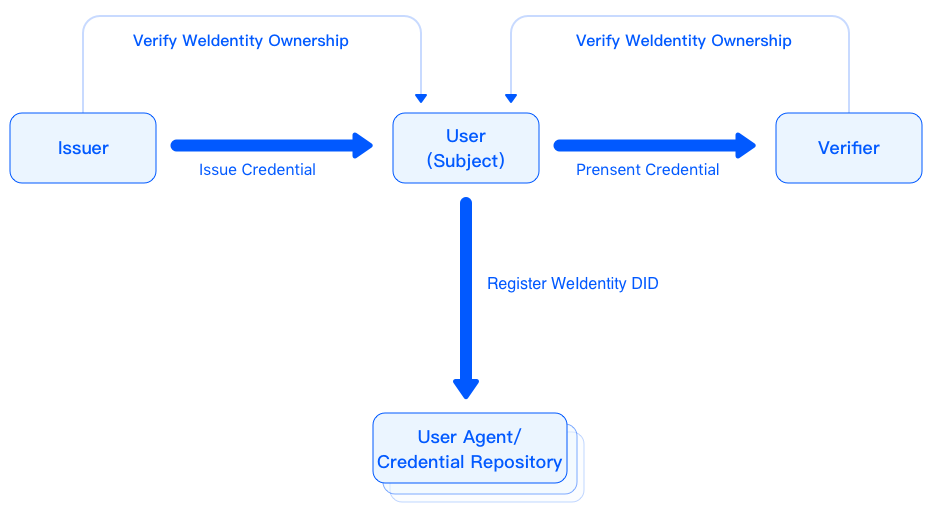

.. _one-stop-experience:

WeIdentity 一站式体验
======================

本页化繁为简地聊了聊WeIdentity，您可以在此快速了解WeIdentity的参考场景、体验Demo、快速部署并体验WeIdentity的核心功能。
如果您是开发人员，还可以进一步了解WeIdentity的参考实现，以及深入了解SDK的使用方式。

WeIdentity参考场景
-------------------

在WeIdentity生态中，存在着上图所示的几类角色，不同角色的权责和角色之间的关系如下表所示：

.. list-table::
   :header-rows: 1

   * - 角色
     - 说明
   * - User (Entity)
     - 用户（实体）。会在链上注册属于自己的WeIdentity DID，从Issuer处申请Credential，并授权转发或直接出示给Verifier来使用之。
   * - Issuer
     - Credential的发行者。会验证实体对WeIdentity DID的所有权，其次发行实体相关的Credential。
   * - Verifier
     - Credential的使用者。会验证实体对WeIdentity DID的所有权，其次在链上验证Credential的真实性，以便处理相关业务。
   * - User Agent / Credential Repository
     - 用户（实体）在此生成WeIdentity DID。为了便于使用，实体也可将自己的私钥、持有的Credential托管于此。

在实际业务里，WeIdentity可以被广泛运用在「实体身份标识」及「可信数据交换」场景中。首先，User Agent会为不同的实体生成独立唯一互不相同的DID；其次，Issuer在验证了实体身份及DID所有权后，会为实体发行各种各样的电子化Credential。实体可以将这些Credential存在实体私有本地存储，也可以托管给某个凭证存储机构；当实体需要去Verifier办理某种业务的时候，实体可以直接将Credential出示给Verifier，也可以通过在链上进行主动授权的方式由凭证存储机构转发给Verifier。以上流程保证了数据以实体用户为中心，同时实体身份、确权、授权等操作在链上完成，可以追溯，不可篡改。

Demo体验
---------- 

下面提供了几个不同场景的WeIdentity Demo：

.. list-table::
   :header-rows: 1

   * - 使用场景
     - 访问入口
     - 设计说明
   * - 学历信息电子化
     - \ `开始体验 <https://sandbox.webank.com/weid>`_\
     - 基于WeID，将用户身份同电子身份ID对应的学历信息电子化，Hash上链，保证身份和学历信息高效验证，不可篡改
   * - 游戏积分上链
     - \ `游戏页面 <https://sandbox.webank.com/weidgame/>`_\
     
       \ `计分板 <https://sandbox.webank.com/weidgame/scoreboard.html>`_\
     - 基于WeID，用户游戏积分需要授权才会发到区块链上进行统计，可以看到详细的链上授权记录，不可篡改

快速部署与上手
----------------

您可以参照 \ `部署文档 <./weidentity-installation.html>`_\，进行WeIdentity的快速部署与上手。

深入了解：SDK文档
------------------

您可以参照\ `RestService文档 <./weidentity-rest.rst>`_\或\ `Java SDK文档 <https://weidentity.readthedocs.io/projects/javasdk/zh_CN/latest/>`_\，深入了解WeIdentity的技术细节。