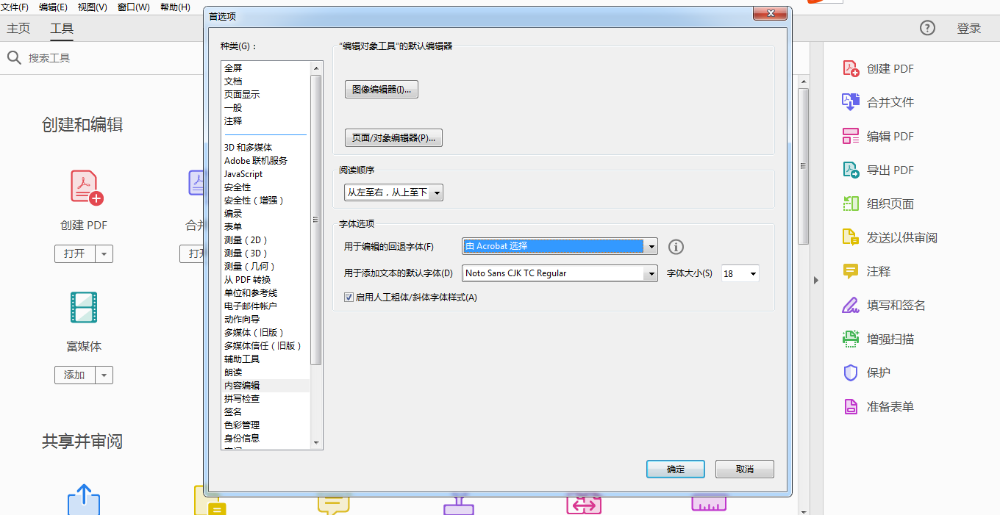
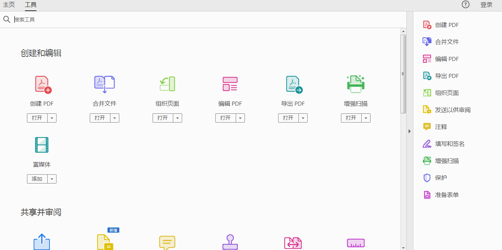
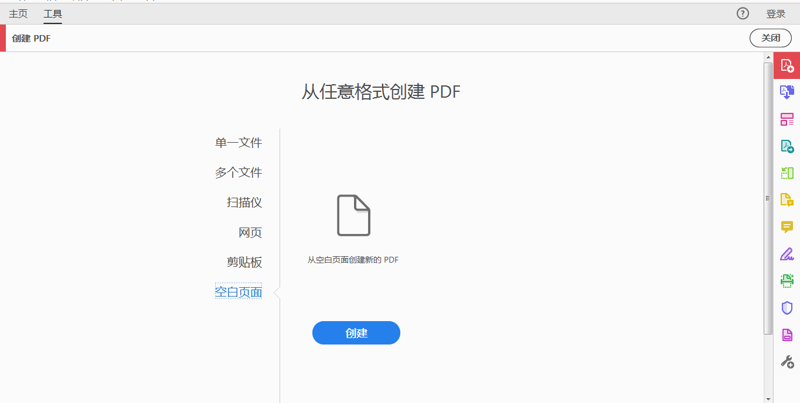
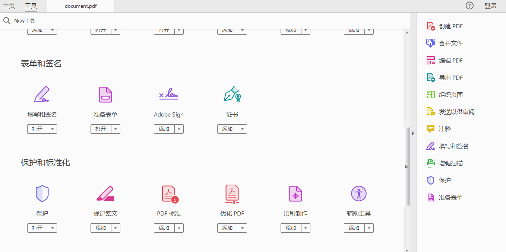
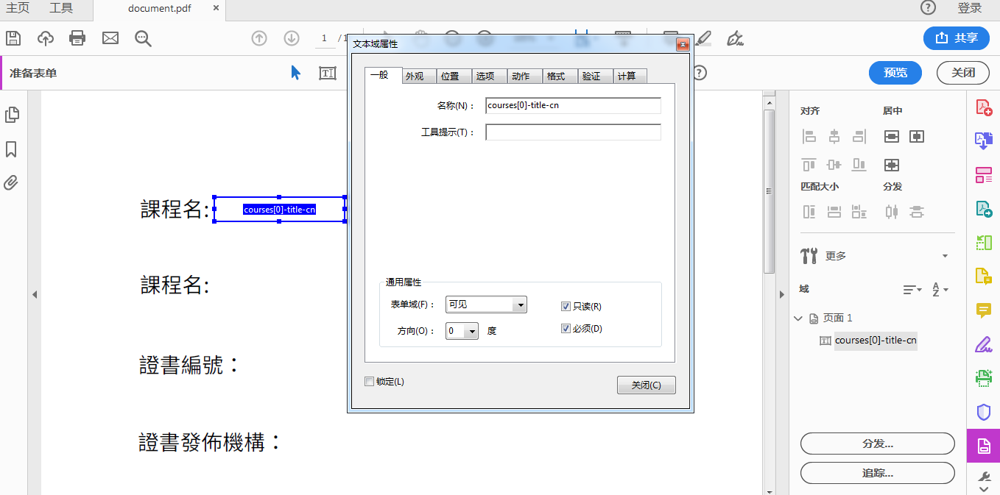
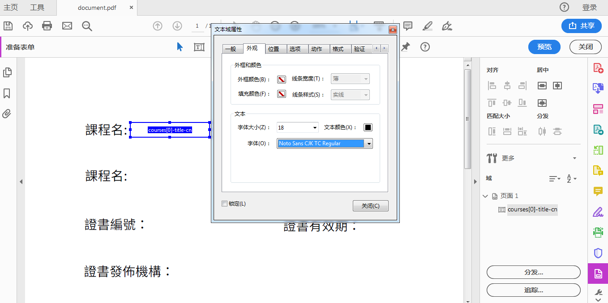
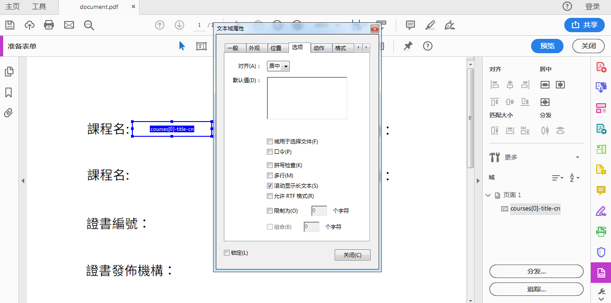

**使用Acrobat Pro DC制作PDF模板**
 

1. 安装NotoSansCJKtc-Regular.ttf 字体。[字体下载链接](https://github.com/WeBankFinTech/WeIdentity/blob/master/context/NotoSansCJKtc-Regular.ttf) 
2. 打开Acrobat Pro DC，点击编辑选项->首选项->内容编辑，设置用于添加文本的默认字体为NotoSansCJKtc-Regular.ttf 

     
 
3. 进入工具选择界面 

      
 
4. 选择从空PDF页面创建PDF或者指定某个PDF文件 

      
 
5. 创建PDF后，选择编辑PDF 

      
 
6. 点击添加文本，添加需要设置的域；注意字体是否为NotoSansCJKtc-Regular.ttf，添加文本完成后选择保存 

      
 
7. 进入工具选项，选择准备表单 

       
 
8. 选择已添加文本的PDF文件 

       
 
10. 选择插入表单 

       

11. 设置表单的名称属性，若cpt包含多级，则用“-”连接各级的key值，以确保唯一性。如cpt中各级为courses、title、cn等，其中courses是一个数组，则必须使用courses[i]来标识是第几个元素 

       

12. 设置表单文本域中填入文本的字体及其字体大小。请使用前面步骤安装的NotoSansCJKtc-Regular.ttf字体作为文本字体。选择字体大小时注意文本框大小，如果无法确认将填入的文本长度，可选择字体大小为自动 

      
 
13. 设置表单文本域中填入文本的对齐方式，并勾选滚动显示长文本 

      
 
14. 添加完成后点击保存即可 

      
 
 
**注意事项：**
- 必须要先安装指定字体，并用指定字体设置文本以及表单。
- NotoSansCJKtc-Regular.ttf字体为google开源字体，不存在商用版权问题。
- 确保多级cpt中各级使用“-”连接。
- 如果编辑PDF文件时遇到“无法找到或创建字体XXX，某些字体可能无法正确显示或打印”问题时，把相应字体文件复制到Adobe安装目录下的Adobe/Acroba DC/Resource/CIDFont文件夹中，重启Acrobat Pro DC即可。

