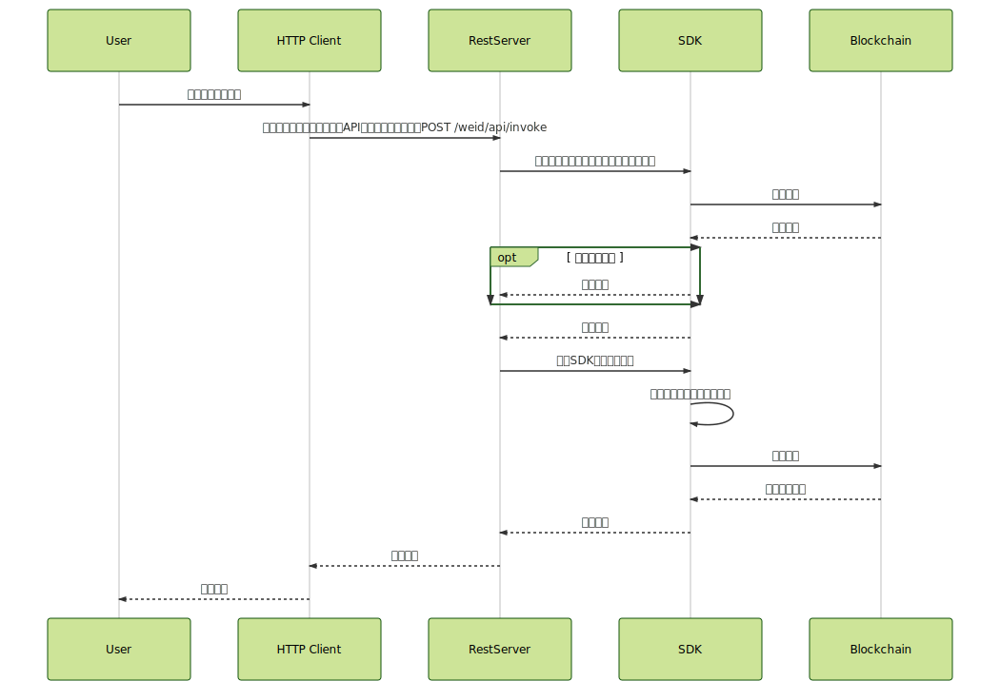

.. _weidentity-rest-design:

WeIdentity RestService 设计文档
----------------------------------------

1. 设计理念
^^^^^^^^^^^^^^^^^^^^^^^^^^^^^^^^^^^^^^^^^^^^^

RestService的设计秉持以下原则：

- 私钥在网络上进行传输是有可能遭遇窃听或中间人攻击的。因此，如果牵扯到远程调用，应该尽可能避免把私钥作为输入参数；私钥托管在RestService服务端。
- 另一方面，用户的发交易需求可能不限制于对WeIdentity SDK，也包括WeEvent、WeSign等其他组件，而客户可能不愿意安装多个SDK。为解决该问题，RestService提供了一整套通用的各SDK的访问逻辑、参数定义解决方案，使得用户的签名操作与具体业务、具体SDK、具体合约解耦。
- 在某些场景下，机构或用户可能不支持使用Java环境调用SDK；对此，使用RestService的另一个好处便是降低了多语言版本的SDK的开发成本。用户只要有发送HTTP请求的能力即可以调用WeIdentity的相关功能。
- RestService服务端所有API均为无状态的。

2. RestService整体技术架构
^^^^^^^^^^^^^^^^^^^^^^^^^^^^^^^^^^^^^^^^^^^^^

2.1 架构图
~~~~~~~~~~~~~~~~~~~~~~~~~~~~~~~~~~~~~~~

RestService架构包括以下模块：

* 用户应用：用户的业务app应用，发送HTTP请求
* rest-server：Server服务器端
* weidentity-java-sdk：WeIdentity的SDK

2.2 交易模型
~~~~~~~~~~~~~~~~~~~~~~~~~~~~~~~~~~~~~~~

过去的做法是：

* 用户传入接口参数（包括私钥），直接调用RESTful接口，weidentity-http-service调用sdk然后发送交易；

改造后：

* 用户应用调传入自己的私钥索引以指明自己使用哪个私钥，然后POST /weid/api/invokeTransaction，发送请求给weidentity-http-service
* weidentity-http-service接受请求，依据索引载入所托管的私钥，调用weidentity-java-sdk的对应方法，发送交易给区块链节点

3. 调用时序说明
^^^^^^^^^^^^^^^^^^^^^^^^^^^^^^^^^^^^^^^^^^^^^

步骤说明：

- 用户组装方法名、业务输入参数、API版本号、私钥索引，并发送POST /weid/api/invoke，要求调用函数。
- Server访问SDK进行入参检测，若通过，索引其托管在Server端的私钥，使用私钥进行签名，随后调用SDK相关合约方法并返回结果。
