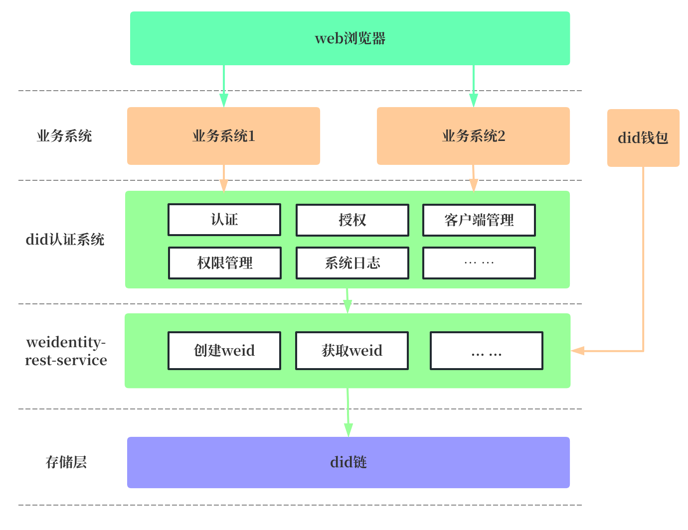
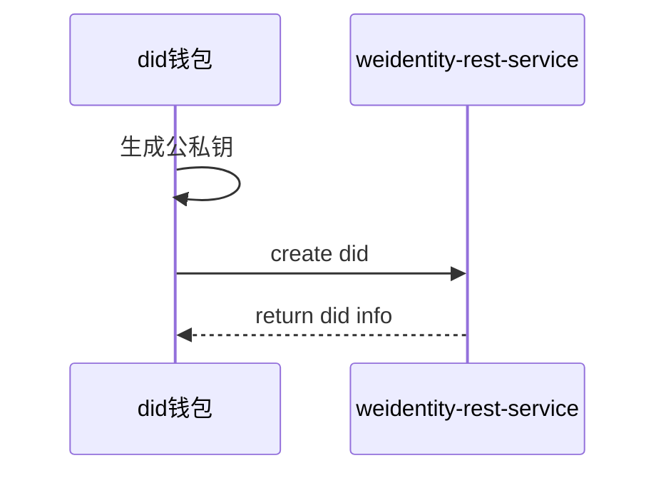
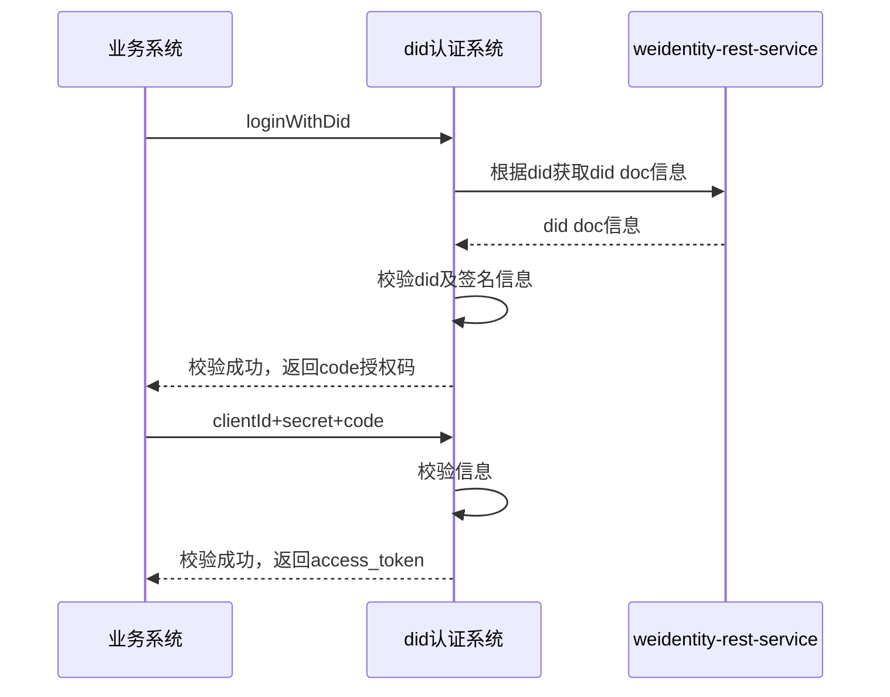

# 基于did的单点登录

## 1.赛题描述

参考[login.xyz](https://docs.login.xyz/) 实现基于Weldentity或者FISCO BCOS地址的单点登录Demo

(实现提供简单的网站登录页面，输入Weld和签名即可登录，签名可以通过任意方式得到，但是签名的内容由demo的服务器在登录的时候提供，鉴权过程可以使用任意协议比如OAuth2.0，具体的鉴权方式则是调用Weldentity的接口验证前端提供的Weldentity)，Sign-In with Weldentity or FISCO BCOS

## 2.题目分析

### 2.1 概要

- login.xyz 概念和实现原理；
- OAuth 2.0鉴权协议；
- Weldentity 相关接口；

### 2.2 login.xyz

sign-in with Ethereum是一种使用以太坊区块链技术进行身份验证的方式。它的技术原理如下：

- 用户使用以太坊钱包（如 MetaMask）创建自己的数字身份，并生成一个公钥和私钥对；
- 用户在登录页面上选择 "sign-in with Ethereum" 选项，并使用以太坊钱包进行身份验证；
- 登录页面向用户的钱包发送一个随机字符串，要求用户用私钥对该字符串进行签名；
- 用户使用钱包中的私钥对随机字符串进行签名，并将签名结果发送回登录页面；
- 登录页面使用公钥验证签名结果的有效性，如果验证通过，则认为用户已经通过身份验证，可以登录系统；

上述实现的核心逻辑就是：私钥签名 -> 公钥解密 -> 对比内容通过则证明用户持有公钥对应的私钥 -> 证明用户身份合法性

### 2.3 OAuth 2.0鉴权协议

详细的oatuh2.0协议相关理论知识可以参考[oatuh2.0](https://oauth.net/2/)，这里我们介绍下当前项目下，每个模块分别在对应协议中角色。在oauth2.0中，包括如下角色：

- 资源所有者：拥有受保护的资源（如用户）；
- 客户端：代表资源所有者访问受保护的资源；
- 授权服务器：颁发访问令牌（access token）给客户端，以便客户端能够访问受保护的资源；
- 资源服务器：存储受保护的资源，并对客户端发出的访问令牌进行验证。

在该项目中，资源所有者即拥有did的用户，客户端则是指不同的业务系统，授权服务器则是指did认证服务系统，为了尽量引入少的系统，我们授权服务器和资源服务器使用同一系统实现，都在did认证服务系统中实现。

### 2.4 WeIdentity-Rest-Service

我们通过搭建并调用`WeIdentity-Rest-Service`([code github地址](https://github.com/WeBankBlockchain/WeIdentity-Rest-Service/tree/develop))服务完成did相关的功能。主要接口如下：

- encode:
  - 请求地址：http://{{host}}:{{httpport}}/weid/api/encode
  - 入参：
    ```json
    {
        "functionArg": {
            "publicKey": "712679236821355231513532168231727831978932132185632517152735621683128"
        },
        "transactionArg": {
            "nonce": "1474800601011307365506121304576347479508653499989424346408343855615822146039"
        },
        "functionName": "createWeId",
        "v": "1.0.0"
    }
    ```
  - 返回值：
    ```json
    {
      "respBody": {
        "blockLimit": "570",
        "data": "0x635ef5a5000000000000000000000000133419735082a1207bf4fb1f067da39e71865fe1000000000000000000000000000000000000000000000000000000000000008000000000000000000000000000000000000000000000000000000000000000c00000000000000000000000000000000000000000000000000000000000000240000000000000000000000000000000000000000000000000000000000000000d31363937303932333532303738000000000000000000000000000000000000000000000000000000000000000000000000000000000000000000000000000001000000000000000000000000000000000000000000000000000000000000002000000000000000000000000000000000000000000000000000000000000001046469643a776569643a313a307831333334313937333530383261313230376266346662316630363764613339653731383635666531236b6579732d39393230653732642c45643235353139566572696669636174696f6e4b6579323032302c6469643a776569643a313a3078313333343139373335303832613132303762663466623166303637646133396537313836356665312c7a33616e784a536b43716f55427a695a7a326e66385238393442386d47676e67384255767335724a744e424a6535666b364b364c52706154524d3365586b43436a6b4c39647a617533666144794141715a504e61507166646d34727168664e4a357239376745664774533648614e56000000000000000000000000000000000000000000000000000000000000000000000000000000000000000000000000000000000000000000000001000000000000000000000000000000000000000000000000000000000000002000000000000000000000000000000000000000000000000000000000000000786469643a776569643a313a3078313333343139373335303832613132303762663466623166303637646133396537313836356665312330346238643861652c57654964656e746974792c68747470733a2f2f6769746875622e636f6d2f576542616e6b426c6f636b636861696e2f57654964656e746974790000000000000000",
        "encodedTransaction": "+QNYiGnvXSDiaQnqhRdIduf/hRdIduf/ggI6lLO71DAWvDlB6wv6ikw01dv+NLA1gLkDJGNe9aUAAAAAAAAAAAAAAAATNBlzUIKhIHv0+x8GfaOecYZf4QAAAAAAAAAAAAAAAAAAAAAAAAAAAAAAAAAAAAAAAACAAAAAAAAAAAAAAAAAAAAAAAAAAAAAAAAAAAAAAAAAAMAAAAAAAAAAAAAAAAAAAAAAAAAAAAAAAAAAAAAAAAACQAAAAAAAAAAAAAAAAAAAAAAAAAAAAAAAAAAAAAAAAAANMTY5NzA5MjM1MjA3OAAAAAAAAAAAAAAAAAAAAAAAAAAAAAAAAAAAAAAAAAAAAAAAAAAAAAAAAAAAAAAAAAAAAQAAAAAAAAAAAAAAAAAAAAAAAAAAAAAAAAAAAAAAAAAgAAAAAAAAAAAAAAAAAAAAAAAAAAAAAAAAAAAAAAAAAQRkaWQ6d2VpZDoxOjB4MTMzNDE5NzM1MDgyYTEyMDdiZjRmYjFmMDY3ZGEzOWU3MTg2NWZlMSNrZXlzLTk5MjBlNzJkLEVkMjU1MTlWZXJpZmljYXRpb25LZXkyMDIwLGRpZDp3ZWlkOjE6MHgxMzM0MTk3MzUwODJhMTIwN2JmNGZiMWYwNjdkYTM5ZTcxODY1ZmUxLHozYW54SlNrQ3FvVUJ6aVp6Mm5mOFI4OTRCOG1HZ25nOEJVdnM1ckp0TkJKZTVmazZLNkxScGFUUk0zZVhrQ0Nqa0w5ZHphdTNmYUR5QUFxWlBOYVBxZmRtNHJxaGZOSjVyOTdnRWZHdFM2SGFOVgAAAAAAAAAAAAAAAAAAAAAAAAAAAAAAAAAAAAAAAAAAAAAAAAAAAAAAAAAAAAAAAAAAAAAAAAAAAAAAAQAAAAAAAAAAAAAAAAAAAAAAAAAAAAAAAAAAAAAAAAAgAAAAAAAAAAAAAAAAAAAAAAAAAAAAAAAAAAAAAAAAAHhkaWQ6d2VpZDoxOjB4MTMzNDE5NzM1MDgyYTEyMDdiZjRmYjFmMDY3ZGEzOWU3MTg2NWZlMSMwNGI4ZDhhZSxXZUlkZW50aXR5LGh0dHBzOi8vZ2l0aHViLmNvbS9XZUJhbmtCbG9ja2NoYWluL1dlSWRlbnRpdHkAAAAAAAAAAAEBgA=="
      },
      "loopback": null,
      "errorCode": 0,
      "errorMessage": "success"
    }
    ```
- transcat
  - 请求地址：http://{{host}}:{{httpport}}/weid/api/tanscat
  - 入参：
    ```json
    {
      "functionArg": {},
      "transactionArg": {
          "nonce": "1474800601011307365506121304576347479508653499989424346408343855615822146039",
          "blockLimit": "570",
          "signType": "2",
          "data": "0x635ef5a5000000000000000000000000133419735082a1207bf4fb1f067da39e71865fe1000000000000000000000000000000000000000000000000000000000000008000000000000000000000000000000000000000000000000000000000000000c00000000000000000000000000000000000000000000000000000000000000240000000000000000000000000000000000000000000000000000000000000000d31363937303932333532303738000000000000000000000000000000000000000000000000000000000000000000000000000000000000000000000000000001000000000000000000000000000000000000000000000000000000000000002000000000000000000000000000000000000000000000000000000000000001046469643a776569643a313a307831333334313937333530383261313230376266346662316630363764613339653731383635666531236b6579732d39393230653732642c45643235353139566572696669636174696f6e4b6579323032302c6469643a776569643a313a3078313333343139373335303832613132303762663466623166303637646133396537313836356665312c7a33616e784a536b43716f55427a695a7a326e66385238393442386d47676e67384255767335724a744e424a6535666b364b364c52706154524d3365586b43436a6b4c39647a617533666144794141715a504e61507166646d34727168664e4a357239376745664774533648614e56000000000000000000000000000000000000000000000000000000000000000000000000000000000000000000000000000000000000000000000001000000000000000000000000000000000000000000000000000000000000002000000000000000000000000000000000000000000000000000000000000000786469643a776569643a313a3078313333343139373335303832613132303762663466623166303637646133396537313836356665312330346238643861652c57654964656e746974792c68747470733a2f2f6769746875622e636f6d2f576542616e6b426c6f636b636861696e2f57654964656e746974790000000000000000",
          "signedMessage": "HEugP13uDVBg2G0kmmwbTkQXobsrWNqtGQJW6BoHU2Q2VQpwVhK382dArRMFN6BDq7ogozYBRC15QR8ueX5G3t8="
      },
      "functionName": "createWeId",
      "v": "1.0.0"
    }  
    ```
  - 返回值：
    ```json
    {
      "respBody":"did:weid:1:0x133419735082a1207bf4fb1f067da39e71865fe1",
      "loopback":null,
      "errorCode":0,
      "errorMessage":"success"
    }
    ```
- invoke
  - 请求地址：http://{{host}}:{{httpport}}/weid/api/invoke
  - 入参：
    ```json
    {
      "functionArg": {
        "weId":"did:weid:1:0x133419735082a1207bf4fb1f067da39e71865fe1"
      },
      "transactionArg": {},
      "v": "1.0.0",
      "functionName": "getWeIdDocument"
    }
    ```
  - 返回值：
    ```json
    {
      "respBody": {
        "resolutionMetadata": {
            "contentType": "JSON-LD",
            "error": null
        },
        "weIdDocumentJson": "{\"@context\" : \"https://github.com/WeBankFinTech/WeIdentity/blob/master/context/v1\",\n  \"id\" : \"did:weid:1:0x3e597137b2dd9009b35f59d2256e671b9145ad51\",\n  \"authentication\" : [ {\n    \"id\" : \"did:weid:1:0x3e597137b2dd9009b35f59d2256e671b9145ad51#keys-fdf8e284\",\n    \"type\" : \"Ed25519VerificationKey2020\",\n    \"controller\" : \"did:weid:1:0x3e597137b2dd9009b35f59d2256e671b9145ad51\",\n    \"publicKeyMultibase\" : \"z3anxJUsFwuR5AvKRqaTCLJ8fTmQcBZNLNLpyq2dECuvbSC1so8dC3Fvz343q3m7py3uwxXLUbB5dgfH2CX36AMpuoAqPe1nwjaWKrto76tf59R\",\n    \"publicKey\" : \"72907716505989393088186550107679567364185218721963761981761904328221802680748\"\n  } ],\n  \"service\" : [ {\n    \"id\" : \"did:weid:1:0x3e597137b2dd9009b35f59d2256e671b9145ad51#04b8d8ae\",\n    \"type\" : \"WeIdentity\",\n    \"serviceEndpoint\" : \"https://github.com/WeBankBlockchain/WeIdentity\"\n  } ]\n}",
        "weIdDocumentMetadata": {
            "created": null,
            "updated": null,
            "deactivated": false,
            "versionId": 1
        }
      },
      "loopback": null,
      "errorCode": 0,
      "errorMessage": "success"
    }
    ```

上述接口中，encode和transcat主要是为了通过用户的公钥和私钥创建did，供`did-wallet`工具调用，invoke接口则是为了通过did获取公钥信息使用，供did认证系统使用。

## 3.系统设计

### 3.1 总体设计

通过分析题目要求和涉及的技术，系统架构设计如下：



结合上述的系统架构，主要功能模块包括did钱包、业务系统以及did认证系统这三个模块。

### 3.2 did钱包

did钱包，用于管理私钥和did信息的客户端，功能类似于MetaMask，其与业务系完全独立，主要功能如下：

1. 公私钥生成和存储功能；
2. 生成did功能；
3. 使用私钥进行签名功能。

#### 时序图



### 3.2 业务系统

为了体现sso单点登录的效果，这里我们分别实现两个业务系统，当通过一个业务系统登录成功后，同一did用户在登录另外一个业务系统时，可以根据token信息直接实现登录。

根据login.xyz和oauth2.0协议，系统主要实现流程设计如下：

1. 用户通过did钱包生成公私钥和did信息，此时用户did和对应的did doc已经成功上链；
2. 通过业务系统点击did跳转登录，即Sign-In With WeIdentity，这里会将页面跳转到did认证系统的界面上，认证系统通过用户输入的did和签名信息；
3. 认证系统验证成功后，返回code给业务系统；
4. 业务系统通过code获取access_token，当用户在上述step1中登录成功后，did认证系统会返回一个code，业务系统通过在did认证系统clientId、secret以及code一同提交至did认证系统；
5. 认证成功后，did认证系统会将access_token返回给业务系统，业务系统可以基于该access_token对资源服务器进行访问。

#### 时序图



### 3.3 认证系统

did认证系统是整个项目的核心，其需要实现基于oauth2.0协议的主要功能，能够对访问资源服务器进行认证、授权以及三方客户端的管理等功能。这里我们基于oatuh2.0中`authorization_code`授权模式实现了认证通过http协议对外提供的功能如下：

1. authorize: 获取授权code，根据客户端注册在认证系统的clientId为客户端生成code码；
2. token：通过code获取token，客户端通过clientId+secret的认证方式，并将code码传送过来，生成token后，返回给客户端；
3. login：该功能是通过did+signature验证用户的身份信息，验证通过则代表用户登录成功；
4. verify：校验第三方客户端即（章节3.2 业务系统）access_token是否合法。

## 4.系统实现

> 这部分完成主要功能模块的开发工作，介绍该系统主要使用的技术和部分代码实现，所有的核心代码都是通过go语言实现。

系统开发的详细实现和介绍在各个代码仓库下的`README.md`中进行讲解，功能模块和代码对应关系如下：

- did钱包 --> did-wallet
- 业务系统 --> did-client1、did-client2，两个业务系统代码一致
- 认证系统 --> did-server
- 前端 --> web1、web2，对应两个业务系统的前端

项目的目录结构如下图所示。

```shell
src
├── did-client
├── did-client2 
├── did-server
├── did-wallet
├── web1
└── web2
```


**注意**：
  1. 该系统运行前提条件是，你已经通过官方文档将 `WeIdentity-Rest-Service`和 `fisco-bcos链` 部署并运行，项目运行依赖于did接口，并且会将did上到链上;
  2. 安装go环境，version >= 1.20.x；

## 5.web前端服务启动

### 5.1 前端启动

1. 安装node v14.18.x
2. 修改 /web1/vue.config.js文件中的ip和port信息，修改为你需要运行的地址；


3. 运行服务
```shell
# 进入web1目录
cd web1
# 首次运行需要先安装依赖
npm install
npm start
```
4. 运行成功后，截图如下：


## 6.主要参考

1. [WeIdentity-Rest-Service Doc](https://weidentity.readthedocs.io/zh_CN/latest/docs/weidentity-rest.html)
2. [oauth 2.0协议](https://oauth.net/2/)
3. [oauth 2.0协议使用](https://www.ruanyifeng.com/blog/2014/05/oauth_2_0.html)
4. [oauth 2.0 golang](https://github.com/golang/oauth2)
