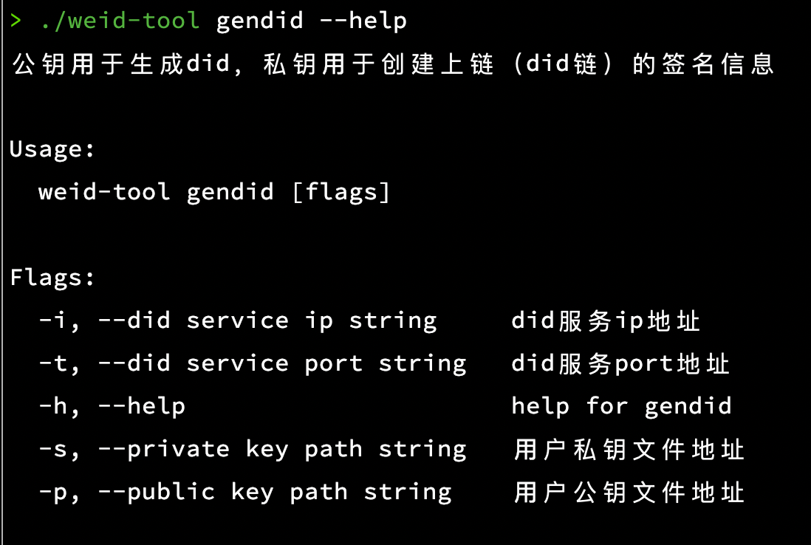

# did-wallet did钱包

did-wallet即用户钱包功能，用户可以通过该钱包申请公私钥和weid信息。这里采用go实现，并且通过命令行的方式对外提供功能。

## 功能简介

- 目录

```shell
├── README.md
├── go.mod
├── go.sum
├── logic
│   ├── crypto.go
│   ├── model.go
│   └── weid.go
└── main.go
```

- 核心代码
  did-wallet目前核心功能在logic包下面进行实现，`crypto.go`、`weid.go`包实现了关于密钥和weid的核心功能，主要代码如下：

crypto.go

```go
func GenerateKeyPair() (publicKeyBytes []byte, privateKeyBytes []byte, publicKeyBigInt *big.Int, privateKeyBigInt *big.Int) {
	key, err := ecdsa.GenerateKey(secp256k1.S256(), rand.Reader)
	if err != nil {
		panic(err)
	}

	publicKeyBytes = elliptic.MarshalCompressed(secp256k1.S256(), key.X, key.Y)
	publicKeyBigInt = new(big.Int).SetBytes(publicKeyBytes[1:])
	privateKeyBytes = convertPrivateKeyBigIntToPrivateKeyBytes(key.D)
	return publicKeyBytes, privateKeyBytes, publicKeyBigInt, key.D
}

func convertPrivateKeyBigIntToPrivateKeyBytes(privateKeyBigInt *big.Int) []byte {
	privateKeyBytes := make([]byte, 32)
	blob := privateKeyBigInt.Bytes()
	copy(privateKeyBytes[32-len(blob):], blob)
	return privateKeyBytes
}
```

weid.go

```go
// CreateWeId 传入公钥和私钥，创建weid
func CreateWeId(serverIp, port string, pubBytes []byte, privBytes []byte) (string, error) {
	funcName := "createWeId"
	nonce := generateNonce()
	encodeResponseStr, err := consumeCreateWeIdEncodeRestApi(serverIp, port, getPublicBigIntByBytes(pubBytes), nonce, funcName)
	if err != nil {
		fmt.Printf("create weid has some err %v\n", err)
		return "", err
	}

	transactResponseStr, err := processEncodeResponse(encodeResponseStr, serverIp, port, funcName, nonce, privBytes)
	if err != nil {
		fmt.Printf("processEncodeResponse has some err %v\n", err)
		return "", err
	}

	transactResponse, err := convertJsonToTransactResponseStruct(transactResponseStr)
	if err != nil {
		fmt.Printf("convertJsonToTransactResponseStruct has some err %v\n", err)
		return "", err
	}
	if transactResponse.ErrorCode != 0 {
		fmt.Printf("%#v", transactResponse)
		return "", errors.New(transactResponse.ErrorMessage)
	}

	return transactResponse.RespBody, nil
}
```

1. GenerateKeyPair 方法生成公私钥及其big Int，其他方法调用该方法并将公私钥写到本地文件中；
2. CreateWeId 方法则根据传入的公私钥信息，调用 `WeIdentity-Rest-Service` 接口，生成weid并返回；

- 使用方式

本工具提供3个主要功能：

1. key: 生成公私钥到本地文件中，默认文件名称为：priv.key、pub.key，分别代表公私钥文件；
2. gendid: 读取公私钥文件，并根据指定接口生成weid；
3. sign: 使用私钥进行签名，并返回base64后的签名信息；

上述命令详细使用如下：

```shell
# 编译工具
go build -o weid-tool
# 生成公私钥
./weid-tool key
generate private key in ./priv.key
generate public key in ./pub.key
# 生成weid
> ./weid-tool gendid -p "./pub.key" -s "./priv.key" -i "192.168.0.95" -t "6001"
http://192.168.0.95:6001/weid/api/encode
http://192.168.0.95:6001/weid/api/transact
generate weid success: did:weid:1:0xa3877c6c598f96ca69350f33f297ec8bb4afd762
# 签名
./weid-tool sign "bf68a343-7db2-4565-99d6-ea545aa53cda" -p ./priv.key
Message: bf68a343-7db2-4565-99d6-ea545aa53cda
Signature: Msuym6gIWXTHxU+bJYkb9u8XqhvNAVcC1LNaKAselF1LViCazW5bZeYnX7Ax1ksfGddu4E4bQ25MgoN0/aupnQA=
```

命令详情可以通过: 【命令名称】--help 查看，示例如图：


