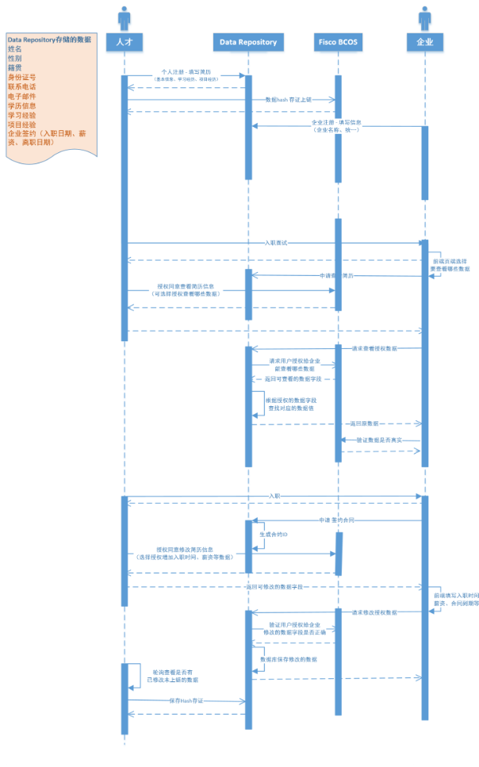

# **Task 20**

#### **任务** 

开发基于DID的数据授权共享案例(定义具体且通用的数据结构，在数据的拥有者授权下某些应用方可以更改或查询拥有者的部分数据)

#### 构想案例

构想设计一个人才链系统，该人才链系统里面人才可以和企业去签约信息，人才可以授权企业去修改对应签约信息，同时人才也可以通过获取和企业认证获取真实项目经验的凭证。(目前只涉及到了人才可以授权企业去修改对应签约信息)

#### **设计思路**

1.数据结构定义：需要定义一个通用的数据结构，包含拥有者的身份信息和关键数据字段。这些数据字段用来标识所对应的用户数据的授权情况。

2.DID标识符生成：每个参与者（人才或企业）都需要注册一个 WeIdentity DID，并在区块链上进行身份认证。

3.授权管理与验证：拥有者可以通过智能合约实现对自己的数据进行授权管理，即授权特定的应用方查询或修改自己的部分数据。同时，在数据被访问时，需要进行授权验证，以确保只有被授权的应用方才能访问数据。

4.数据管理：核心数据放入后端程序中，链上只记录每个数据授权对象的授权状态。

5.使用 Credential 来授权数据访问：人才可以授权企业对其签约信息进行修改，并可以通过获取和企业认证获得真实项目经验的凭证。为此，人才可以使用 Credential 模块创建一个包含签约信息和项目经验的凭证，并将其授权给指定的企业进行访问。这样，企业就可以在合法授权的前提下修改人才的签约信息，并获取到人才的真实项目经验

#### **流程图**



#### 合约功能设计

合约应该让用户可以管理自己的个人信息，并授权其他用户访问这些信息。同时，颁发机构可以通过该合约来颁发凭证。

1. 颁发机构可以给每个用户颁发对应的凭证。
2. 用户可以授权其他用户访问自己的信息，并设置不同的权限级别。
3. 用户可以撤销对其他用户信息的访问授权。
4. 凭证的拥有者可以更新其凭证的数据。
5. 允许任何用户查看特定凭证的详细信息。
6. 检查凭证是否有效。

#### **合约代码**

```solidity
pragma solidity ^0.8.0;

contract Credential {
    address private issuer; // 颁发机构地址

    uint256 totalCredentialId; //凭证总发行量

    struct CredentialData {
        uint256 credentialId; // 凭证ID
        address wid; // 凭证拥有者的地址(wid)
        string dataHash; // 凭证数据的hash
    }

    //用户数据,0无权限，1仅查看，2可修改  用户地址=》被授权用户地址=》权限
    mapping(address => mapping(address => uint)) public idCard; // 用户身份证授权
    mapping(address => mapping(address => uint)) public phoneNumber; // 用户电话号码授权
    mapping(address => mapping(address => uint)) public email; // 用户邮箱授权
    mapping(address => mapping(address => uint)) public education; // 用户学历信息授权
    mapping(address => mapping(uint => uint)) public learningExperience; // 用户学习项目授权
    mapping(address => mapping(uint => uint)) public projectExperience; //  用户项目经历授权
    mapping(address => mapping(uint => uint)) public enterpriseContract; // 用户企业合同授权

    mapping(address => CredentialData) public credentials; // 存储每个用户的CredentialData
    mapping(address => mapping(uint => bool)) public isCredentialOwner; // 是否是数据拥有者

    event CredentialIssued(
        uint256 credentialId,
        address indexed owner,
        address indexed issuer
    );
    event CredentialUpdated(uint256 credentialId, string newData);
    event CredentialApprovalChanged(uint256 credentialId, bool isApproved);

    constructor() {
        issuer = msg.sender;
    }

    modifier onlyIssuer() {
        require(
            msg.sender == issuer,
            "Only the authority can call this function"
        );
        _;
    }

    modifier onlyCredentialOwner(address _owner, uint _credentialId) {
        require(
            isCredentialOwner[_owner][_credentialId],
            "Only credential owner can call this function"
        );
        _;
    }

    // 允许颁发机构更新颁发机构的地址
    function setIssuer(address _issuer) external onlyIssuer {
        issuer = _issuer;
    }

    // 颁发机构可以给每个用户颁发对应的凭证
    function issueCredential(
        address user,
        string memory dataHash
    ) external onlyIssuer {
        CredentialData storage newCredential = credentials[user];
        newCredential.credentialId = totalCredentialId;
        newCredential.wid = user;
        newCredential.dataHash = dataHash;

        emit CredentialIssued(totalCredentialId, user, issuer);
        totalCredentialId++;
    }

    // 对用户数据进行查看和操作的时候，先验证hash是否一致
    function verifyHash(
        address user,
        string memory dataHash
    ) internal view returns (bool) {
        require(credentials[user].credentialId != 0, "user has no credentials");
        return
            keccak256(abi.encodePacked(credentials[user].dataHash)) ==
            keccak256(abi.encodePacked(dataHash));
    }

    /**
     * @dev 允许用户授权其他用户访问自己的信息
     * @param user 被授权用户
     * @param credentialId 用户IDcredentialId
     * @param accessLevel 授权状态
     * @param infoIndex 信息索引
     * @param learningExperienceId 学习经历ID
     * @param projectExperienceId 项目经历ID
     * @param enterpriseContractId 企业合同ID
     */
    function authorizeAccess(
        address user,
        uint256 credentialId,
        uint[] memory accessLevel,
        uint[] memory infoIndex,
        uint learningExperienceId,
        uint projectExperienceId,
        uint enterpriseContractId
    ) external onlyCredentialOwner(msg.sender, credentialId){
        validateCredential(user, credentialId);
        require(
            accessLevel.length == infoIndex.length,
            "array length mismatch"
        );

        for (uint i = 0; i < infoIndex.length; i++) {
            require(
                infoIndex[i] >= 1 && infoIndex[i] <= 7,
                "invalid information index"
            );

            if (infoIndex[i] == 1) {
                idCard[msg.sender][user] = accessLevel[i];
            } else if (infoIndex[i] == 2) {
                phoneNumber[msg.sender][user] = accessLevel[i];
            } else if (infoIndex[i] == 3) {
                email[msg.sender][user] = accessLevel[i];
            } else if (infoIndex[i] == 4) {
                education[msg.sender][user] = accessLevel[i];
            } else if (infoIndex[i] == 5) {
                learningExperience[msg.sender][
                    learningExperienceId
                ] = accessLevel[i];
            } else if (infoIndex[i] == 6) {
                projectExperience[msg.sender][
                    projectExperienceId
                ] = accessLevel[i];
            } else if (infoIndex[i] == 7) {
                enterpriseContract[msg.sender][
                    enterpriseContractId
                ] = accessLevel[i];
            } else {
                revert("invalid information index");
            }
        }
    }

    /**
     * @dev 检查用户是否有权限访问信息
     * @param user 被查看信息的用户
     * @param infoIndex 信息索引
     * @param learningExperienceId 学习经历ID
     * @param projectExperienceId  项目经历ID
     * @param enterpriseContractId  企业合同ID
     */
    function checkAccess(
        address user,
        uint infoIndex,
        uint learningExperienceId,
        uint projectExperienceId,
        uint enterpriseContractId
    ) public view returns (bool) {
        if (infoIndex == 1) {
            return idCard[user][msg.sender] > 0;
        } else if (infoIndex == 2) {
            return phoneNumber[user][msg.sender] > 0;
        } else if (infoIndex == 3) {
            return email[user][msg.sender] > 0;
        } else if (infoIndex == 4) {
            return education[user][msg.sender] > 0;
        } else if (infoIndex == 5) {
            return learningExperience[user][learningExperienceId] > 0;
        } else if (infoIndex == 6) {
            return projectExperience[user][projectExperienceId] > 0;
        } else if (infoIndex == 7) {
            return enterpriseContract[user][enterpriseContractId] > 0;
        } else {
            revert("invalid information index");
        }

        return false;
    }

    /**
     * @dev 撤销用户对其他用户信息访问授权
     * @param revokedUser 被撤销访问权限的用户
     * @param credentialId 用户credentialId
     * @param infoIndex 信息索引
     * @param learningExperienceId 学习经历ID
     * @param projectExperienceId 项目经历ID
     * @param enterpriseContractId 企业合同ID
     */
    function revokeAccess(
        address revokedUser,
        uint256 credentialId,
        uint infoIndex,
        uint learningExperienceId,
        uint projectExperienceId,
        uint enterpriseContractId
    ) external onlyCredentialOwner(msg.sender, credentialId){

        if (infoIndex == 1) {
            idCard[revokedUser][msg.sender] = 0;
        } else if (infoIndex == 2) {
            phoneNumber[revokedUser][msg.sender] = 0;
        } else if (infoIndex == 3) {
            email[revokedUser][msg.sender] = 0;
        } else if (infoIndex == 4) {
            education[revokedUser][msg.sender] = 0;
        } else if (infoIndex == 5) {
            learningExperience[revokedUser][learningExperienceId] = 0;
        } else if (infoIndex == 6) {
            projectExperience[revokedUser][projectExperienceId] = 0;
        } else if (infoIndex == 7) {
            enterpriseContract[revokedUser][enterpriseContractId] = 0;
        } else {
            revert("invalid information index");
        }
    }

    //允许凭证的拥有者更新其凭证的数据
    function updateCredentialData(
        uint256 credentialId,
        string memory newData
    ) external onlyCredentialOwner(msg.sender, credentialId){
        validateCredential(msg.sender, credentialId);
        require(verifyHash(msg.sender, newData), "data inconsistency");

        credentials[msg.sender].dataHash = newData;
        emit CredentialUpdated(credentialId, newData);
    }

    //允许任何用户查看特定凭证的详细信息
    function getCredentialInfo(
        address user,
        uint256 credentialId
    ) external view returns (uint256, address, string memory) {
        validateCredential(user, credentialId);
        CredentialData storage credential = credentials[user];
        return (credential.credentialId, credential.wid, credential.dataHash);
    }

    // 检查凭证是否有效
    function validateCredential(
        address user,
        uint256 credentialId
    ) internal view {
        require(credentials[user].credentialId != 0, "user has no credentials");
        require(
            credentialId < credentials[user].credentialId,
            "invalid credential id"
        );
    }
}


```

#### 后端操作

1. 颁发机构调用 `issueCredential` 函数来颁发用户的凭证。
2. 用户调用 `authorizeAccess` 函数来授权其他用户访问自己的信息，并设置不同的权限级别。
3. 用户调用 `revokeAccess` 函数来撤销对其他用户信息的访问授权。
4. 凭证的拥有者调用 `updateCredentialData` 函数来更新其凭证的数据。
5. 任何用户可以调用 `getCredentialInfo` 函数来查看特定凭证的详细信息。
6. 在进行操作之前，应该先调用 `validateCredential` 函数来检查凭证是否有效。
