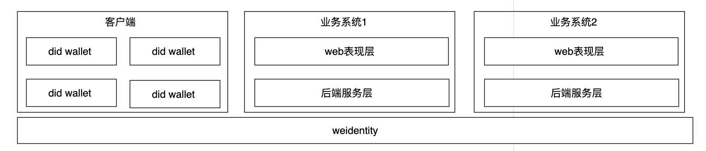

# 基于did的单点登录

## 1.赛题描述

参考login.xyz (https://docs.login.xyz/) 实现基于Weldentity或者FISCO BCOS 地址的单点登录Demo

(实现提供简单的网站登录页面，输入Weld和签名即可登录，签名可以通过任意方式得到，但是签名的内容由demo的服务器在登录的时候提供，鉴权过程可以使用任意协议比如OAuth2.0，具体的鉴权方式则是调用Weldentity的接口验证前端提供的Weldentity)，Sign-In with Weldentity or FISCO BCOS

## 2.题目解析&准备

### 2.1前期准备

- login.xyz 的概念和原理理解清楚；
- OAuth 2.0鉴权协议的使用；
- Weldentity相关接口使用；

#### 2.1.1 login.xyz

sign-in with Ethereum是一种使用以太坊区块链技术进行身份验证的方式。它的技术原理如下：

- 用户使用以太坊钱包（如 MetaMask）创建自己的数字身份，并生成一个公钥和私钥对；
- 用户在登录页面上选择 "sign-in with Ethereum" 选项，并使用以太坊钱包进行身份验证；
- 登录页面向用户的钱包发送一个随机字符串，要求用户用私钥对该字符串进行签名；
- 用户使用钱包中的私钥对随机字符串进行签名，并将签名结果发送回登录页面；
- 登录页面使用公钥验证签名结果的有效性，如果验证通过，则认为用户已经通过身份验证，可以登录系统；

上述实现的核心逻辑就是：私钥签名 -> 公钥解密 -> 对比内容通过则证明用户持有公钥对应的私钥 -> 证明用户身份合法性

#### 2.1.2 OAuth 2.0鉴权协议

### 2.2 主要模块

从题目的流程简述中我们可以确定如下几个功能模块：

1. 业务系统，用户需要登录的中心或联邦化的业务系统，有不同的业务方进行搭建和运营；
2. 客户端，用于管理私钥和did信息的客户端，该部分功能应在用户手中，其与业务系统完全独立；
3. weidentity，该层提供did的核心能力；

系统架构图如下：

下面我们分别从这三个不同模块需要完成的主要工作开始分析。

#### 2.2.1 业务系统

该部分代表不同的业务系统，结合上述赛题，我们需要实现的最基本的功能点如下：

- 用户信息模块，需要保存用户id、密码的基本功能，其他功能可以视情况拓展；
- did管理模块，由于该系统支持did的登录功能，所以我们需要额外的保存did的相关信息；
- weidentity sdk层，该层需要与底层的weidentity链进行交互；

#### 2.2.2 did wallet

did wallet主要提供用户公私钥生成和管理的功能，并且其与weidentity的接口交互，以获取did和did doc的相关信息。

- 公私钥生成和存储功能；
- 签名功能；

#### 2.2.3 weidentity

该层基于weidentity的http接口实现，[官方地址](https://weidentity.readthedocs.io/zh_CN/latest/docs/one-stop-experience.html#id1)。我们首先要搭建weidentity的基础系统，以供业务系统和did wallet调用。
